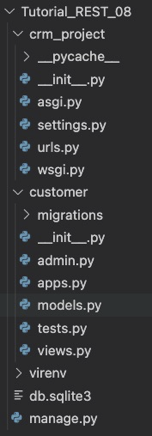
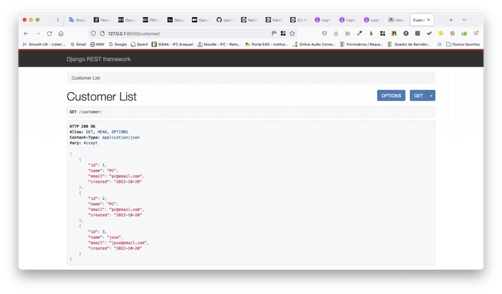
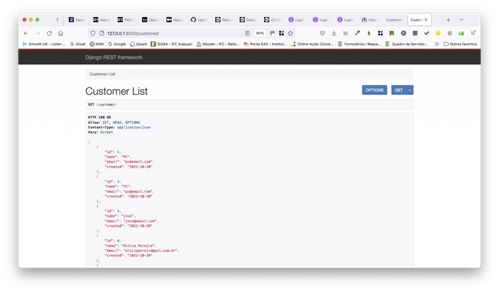

# Tutorial Django REST 08 – Como construir uma API com Django REST Framework e PostgreSQL

Neste tutorial, passaremos pelo procedimento de criação de uma API com Django REST Framework e um Banco de Dados PostgreSQL para um aplicativo de gerenciamento de clientes. Para isso, instalaremos o PostgreSQL e o conectaremos com nossa API. Adicionalmente, realizaremos operações básicas de um CRUD (`GET`, `POST`, `PUT` e `DELETE`) nela.

A título de explanação, o que é o **PostgreSQL**?
É um sistema gerenciador de Banco de Dados relacional gratuito e de código aberto. Ele fornece ao desenvolvedor extensibilidade e escalabilidade. Ele funciona com muitas linguagens de programação e todos os principais sistemas operacionais, como Windows, macOS e Linux. 

Siga atentamente os passos abaixo.

### **Caso o PostGRESQL já esteja instalado em sua máquina, pule para o Passo 2.**

## **Passo 1: Instalando e configurando o PostgreSQL**

1.1) Abra o Terminal no VS Code. Primeiro digite (CTRL+Shift+P) e use a opção “**View: Toggle Terminal**” ou “**Ver: Alternar Terminal**”. Digite na linha de comando o que está indicado abaixo. Observe qual é o Sistema Operacional da sua máquina.

#### **Para instalar no Linux:**
```
sudo apt install postgresql postgresql-contrib
```

#### **Para instalar no macOS:**

```
brew install postgresql@14
```

#### **Para instalar no Windows, você pode baixar um instalador compatível no site oficial do PostgreSQL:**

[Download PostGRESQL Windows](https://sbp.enterprisedb.com/getfile.jsp?fileid=1259019)

No link abaixo você encontra um tutorial sobre a instalação no Windows: [Tutorial de Instalação do PostGRESQL](https://www.devmedia.com.br/instalando-postgresql/23364)

> Caso queira uma ajuda adicional, acesse este [link (instalando o PostGRESQL)](https://www.enterprisedb.com/docs/supported-open-source/postgresql/installing/)


1.2) O comando do **Passo 1.1** acima mudará seu prompt de comando atual para o prompt do usuário `root`. Lá você pode executar vários comandos do PostgreSQL. Por exemplo, para abrir o shell dele, execute o seguinte:

```
psql postgres
```

1.3) Agora, vamos criar um Banco de Dados para este tutorial (projeto). Sempre se certifique de criar um BD separado para cada projeto em que você trabalha. Digite na linha de comando:

```
CREATE DATABASE mydb;
```

No comando acima, usamos o comando `CREATE` em SQL para criar nosso BD que chamamos de `mydb`. Observe que a linha termina com um ponto e vírgula.

1.4) Agora, vamos criar um usuário para nosso Banco de Dados. Vamos chamá-lo de `myuser`. De preferência, substitua a `password` (i.e. senha) por uma forte. Digite o comando abaixo:

```
CREATE USER myuser WITH ENCRYPTED PASSWORD 'password';
```

1.5) Precisamos conceder direitos de acesso ao nosso novo usuário para habilitá-lo a trabalhar no BD. Digite na linha comando:

```
GRANT ALL PRIVILEGES ON DATABASE mydb TO myuser;
```

1.6) E finalmente, para sair do prompt de comando do usuário `postgres` e retornar ao prompt do usuário VS Code, execute isto:

```
exit
```


## **Passo 2: Configure seu ambiente de desenvolvimento**

Sempre que você estiver iniciando um projeto de desenvolvimento web, é uma boa ideia configurá-lo primeiro.

2.1) Abra o Terminal no VS Code. Primeiro digite (CTRL+Shift+P) e use a opção “**View: Toggle Terminal**” ou “**Ver: Alternar Terminal**”.

2.2) Digite na linha de comando do Terminal:

```
cd Django_Tutoriais
mkdir Tutorial_REST_08
cd Tutorial_REST_08
```

2.3) Uma vez dentro do diretório (`Tutorial_REST_08`), crie um ambiente virtual. Para isto, digite o comando a seguir:

```
python3 -m venv virenv
```


2.4) Agora você precisa ativar o ambiente virtual criado no Tutorial anterior, executando o comando abaixo:

**Linux/Mac**

```
source virenv/bin/activate
```

**Windows**

```
.\virenv\Scripts\activate.bat
```

Ou

```
.\virenv\Scripts\Activate.ps1
```

Você saberá que seu ambiente virtual foi ativado, porque o _prompt_ do console no Terminal mudará. Deve ser assim:

```
(virenv) $
```

2.5) Agora que você criou um ambiente virtual, é hora de instalar o Django. Digite na linha de comando:

```
(virenv) $ pip install django psycopg2-binary
```

> Utilizamos o comando `pip` para instalar duas bibliotecas Python, `django` e `psycopg2-binary`. Vamos detalhar cada uma delas:
> 
> `django`: Este é o primeiro pacote que será instalado. Django é um framework web para a linguagem de programação Python. É óbvio que precisamos dele para este tutorial.
> 
> `psycopg2-binary`: Este é o segundo pacote que será instalado. `psycopg2` é o _driver_ (i.e. adaptador) de banco de dados do PostgreSQL mais popular para a linguagem de programação Python. A `psycopg2-binary` é uma versão pré-compilada que facilita a instalação, pois inclui todas as dependências necessárias, evitando a necessidade de compilação local.
> 
> Ao executar este comando, você está preparando o ambiente Python para desenvolver uma aplicação Django que utiliza o banco de dados PostgreSQL.


## **Passo 3: Criando seu projeto em Django**

3.1) Certifique-se de que você está dentro do diretório `Tutorial_REST_08` e o ambiente virtual ativado. Agora, para criar um projeto, digite o comando abaixo.

```
(virenv) $ django-admin startproject crm_project .
```

> Observação: ao criar um novo projeto Django chamado “**crm_project**” certifique-se de incluir o ponto (.) no final do comando para que ele seja instalado no diretório atual.
> 
> O comando acima irá criar uma pasta chamada “**crm_project**” contendo alguns arquivos. No painel esquerdo do VS Code, você verá uma estrutura de diretório que se parece com a figura abaixo. 


## **Passo 4: Testando seu servidor Django**


4.1) Apenas para fins de teste, você pode iniciar o servidor de desenvolvimento que já vem embutido no Django. Para verificar se a configuração foi bem-sucedida, execute o seguinte comando no console do Terminal:

```
python manage.py runserver
```

Ao posicionar o mouse no link "http://127.0.0.1:8000/" você verá a seguinte mensagem:


No Windows irá aparecer “**Seguir o link (ctrl + click)**”. Ao efetuar esta operação, você será direcionado para uma aba do seu browser, e, se tudo estiver correto, você verá uma página da web como a da figura abaixo.


## **Passo 5: Criando uma aplicação em Django**

Para esta parte do tutorial, criaremos uma “**app**” chamada “**customer**”.

5.1) Para criá-la, execute o seguinte comando:

```
python manage.py startapp customer
```

Este comando irá criar um diretório chamado “**customer**” com vários arquivos. Veja a estrutura na figura abaixo.



5.2) Agora que você criou a “**app**”, temos que “instalá-la” no seu projeto. Abra o arquivo (“**crm_project/settings.py**”) e adicione a string `customer` em `INSTALLED_APPS`: (Não se esqueça de colocar a vírgula após a string).

```python
# config/settings.py
INSTALLED_APPS = [
    'django.contrib.admin',
    'django.contrib.auth',
    'django.contrib.contenttypes',
    'django.contrib.sessions',
    'django.contrib.messages',
    'django.contrib.staticfiles',
    'customer',
]
```

> Essa linha de código indica que seu projeto agora sabe que o aplicativo que você acabou de criar existe. 

5.3) Neste mesmo arquivo (“**crm_project/settings.py**”) procure pelo comentário `# Internationalization` e altere as configurações para `LANGUAGE_CODE` e `TIME_ZONE`. Veja a figura abaixo. 


## **Passo 6: Criando a configuração do Banco de Dados**

6.1) Abra o arquivo (“**crm_project/settings.py**”). Substitua o código abaixo nele. 

```python
DATABASES = {
    'default': {
        'ENGINE': 'django.db.backends.postgresql_psycopg2',
        'NAME': 'mydb',
        'USER': 'myuser',
        'PASSWORD': 'password',
        'HOST': 'localhost',
        'PORT': '',
    }
}
```

6.2) Na linha de comando digite o comando abaixo:

```
python manage.py migrate
```


6.3) Agora, para confirmar se tudo está funcionando corretamente, reinicie nosso servidor no Terminal (`python manage.py runserver`), e visite "http://127.0.0.1:8000". Você deverá a seguinte página da web:


## **Passo 7: Criando um Modelo (`Model`) de Banco de Dados**

7.1) Abra o arquivo “**models.py**” no diretório (“**customer/models.py**”). Substitua o conteúdo deste arquivo pelo seguinte código que está abaixo:

```python
# customer/models.py
from django.db import models

class Customer(models.Model):
    name = models.CharField("Name", max_length=240)
    email = models.EmailField()
    created = models.DateField(auto_now_add=True)

    def __str__(self):
        return self.nome
```


7.2) Certifique-se de que o servidor local esteja parado digitando “Control+C” na linha de comando e, em seguida, execute os dois comandos abaixo (em destaque): 

```
python manage.py makemigrations
```

Você verá a seguinte mensagem:

```
Migrations for 'customer':
  customer/migrations/0001_initial.py
    - Create model Customer
```

Agora execute este comando:

```
python manage.py migrate
```

As mensagens serão estas:

```
Operations to perform:
  Apply all migrations: admin, auth, contenttypes, customer, sessions
Running migrations:
  Applying customer.0001_initial... OK
```


## **Passo 8: Incluindo o Django REST Framework e o pacote do PostgreSQL**

Django REST Framework (DRF) é adicionado como qualquer outro aplicativo adicional. Certifique-se de encerrar o servidor local com “Control+C” se ele ainda estiver em execução. 

8.1) Em seguida, na linha de comando, digite os três comandos abaixo:

```
(virenv) $ pip install djangorestframework

(virenv) $ pip install markdown

(virenv) $ pip install django-filter
```

8.2) Abra o arquivo (“**crm_project/settings.py**”) e adicione a seguinte linha de código em `INSTALLED_APPS`: (Não se esqueça de colocar a vírgula após a string).

```python
# config/settings.py
INSTALLED_APPS = [
    'django.contrib.admin',
    'django.contrib.auth',
    'django.contrib.contenttypes',
    'django.contrib.sessions',
    'django.contrib.messages',
    'django.contrib.staticfiles',
    'customer',
    'rest_framework',
]
```

## **Passo 9: Adicionando os URLs da API**

9.1) Abra o arquivo “**crm_project/urls.py**”, e substitua o conteúdo dele pelo código abaixo:

```python
# crm_project/urls.py
from django.contrib import admin
from django.urls import path, include

urlpatterns = [
    path('admin/', admin.site.urls),
    path('customer/', include('customer.urls')), 
]
```

9.2) Crie um arquivo na pasta “**customer**” chamado “**customer/urls.py**”, e adicione o conteúdo abaixo nele:

```python
# customer/urls.py
from django.urls import include, path
from .views import CustomerCreate, CustomerList, CustomerDetail, CustomerUpdate, CustomerDelete

urlpatterns = [
   path('create/', CustomerCreate.as_view(), name='create-customer'),
   path('', CustomerList.as_view()),
   path('<int:pk>/', CustomerDetail.as_view(), name='retrieve-customer'),
   path('update/<int:pk>/', CustomerUpdate.as_view(), name='update-customer'),
   path('delete/<int:pk>/', CustomerDelete.as_view(), name='delete-customer'),
]
```


## **Passo 10: Criando os Serializers**

Um “**serializer**” converte dados em um formato fácil de usar na Internet. Normalmente o formato é JSON, e ele é exibido em um “**endpoint**” de API. Ou seja, ele serve para converter “**models**” do Django em JSON.

10.1) Crie um arquivo na pasta “**customer**” chamado “**customer/serializers.py**”. Adicione o código abaixo.

```python
# customer/serializers.py
from rest_framework import serializers
from .models import Customer
 
class CustomerSerializer(serializers.ModelSerializer):
   class Meta:
      model = Customer 
      fields = ['id', 'name', 'email', 'created']    
```


## **Passo 11: Criando as Views da API**

11.1) Abra o arquivo “**customer/views.p**y” e atualize seu conteúdo com o código abaixo:

```python
# customer/views.py
from django.shortcuts import render
from .models import Customer
from rest_framework import generics
from .serializers import CustomerSerializer

class CustomerCreate(generics.CreateAPIView):
    # API endpoint that allows creation of a new customer
	queryset = Customer.objects.all(),
	serializer_class = CustomerSerializer

class CustomerList(generics.ListAPIView):
    # API endpoint that allows customer to be viewed.
    queryset = Customer.objects.all()
    serializer_class = CustomerSerializer

class CustomerDetail(generics.RetrieveAPIView):
    # API endpoint that returns a single customer by pk.
    queryset = Customer.objects.all()
    serializer_class = CustomerSerializer

class CustomerUpdate(generics.RetrieveUpdateAPIView):
    # API endpoint that allows a customer record to be updated.
    queryset = Customer.objects.all()
    serializer_class = CustomerSerializer

class CustomerDelete(generics.RetrieveDestroyAPIView):
    # API endpoint that allows a customer record to be deleted.
    queryset = Customer.objects.all()
    serializer_class = CustomerSerializer
```


## **Passo 12: Visualizando os Serializers no Browser**

12.1) Agora, ao reiniciar o servidor no Terminal (`python manage.py runserver`), visite "http://127.0.0.1:8000/customer/". Você deverá a seguinte página da web:




## **Passo 13: Populando nosso Banco de Dados**

E se eu pudesse criar vários clientes para nosso BD? Em outras palavras, preciso de uma maneira de gerar vários clientes em nossa base nos dados que já geramos e baseados nas validações que já incluímos na nossa API.

13.1) Na linha de comando digite o comando abaixo:

```
pip install Faker
```

13.2) Crie um arquivo na pasta `Tutorial_REST_08/populate_script.py` e insira o código que está abaixo.

```python
import os, django

os.environ.setdefault('DJANGO_SETTINGS_MODULE', 'crm_project.settings')
django.setup()

from faker import Faker
import random
from customer.models import Customer

def criando_pessoas(quantidade_de_pessoas):
    fake = Faker('pt_BR')
    Faker.seed(10)
    for _ in range(quantidade_de_pessoas):
        name = fake.name()
        email = '{}@{}'.format(name.lower(),fake.free_email_domain())
        email = email.replace(' ', '')
        created = fake.date()
        p = Customer(name=name, email=email, created=created)
        p.save()

criando_pessoas(50)
print("Pessoas criadas com sucesso!")
```

13.3) Na linha de comando digite o comando abaixo:

```	
python populate_script.py
```

Se tudo correu bem, você verá na linha de comando a mensagem: “**Sucesso!**”.

13.4) Agora, ao reiniciar o servidor no Terminal (`python manage.py runserver`), e vá para "http://127.0.0.1:8000/clientes". Você deverá ver a página da web abaixo com vários clientes incluídos na nossa API.



Este tutorial nos ajudou a construir uma API RESTful com o Django REST Framework. Também aprendemos como configurar o PostgreSQL para um projeto Django. Usamos a linha de comando para criar bancos de dados e usuários do PostgreSQL. Conectamos o BD a um aplicativo básico de gerenciamento de clientes Django e adicionamos funcionalidades CRUD à API.