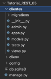
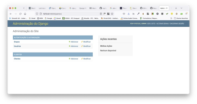
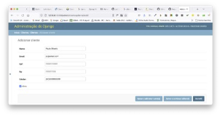
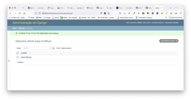
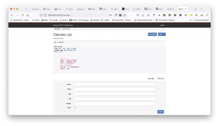
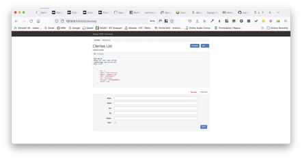
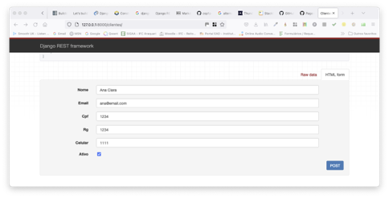
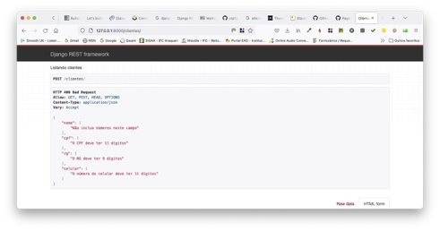
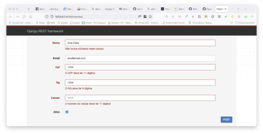
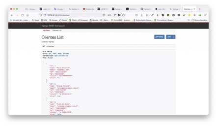

# Tutorial Django REST 05 - Criando Uma Aplicação Web de Clientes e sua API

Neste tutorial vamos construir uma API de Clientes usando o conjunto completo de recursos do Django REST Framework. Vamos ver também como implementar validações personalizadas para garantir a integridade dos dados, como CPF, nome e número de celular, por exemplo. E a "cereja do bolo" será a utilização de scripts para gerar dados "falsos" a fim de "popular" nosso Banco de Dados, o que facilita o teste de nossa API.

Para isto, siga atentamente os passos abaixo.


**Observação Importante: somente o faça depois de fazer o Tutorial Django REST 01**


## **Passo 1: Configure seu ambiente de desenvolvimento**

Sempre que você estiver iniciando um projeto de desenvolvimento web, é uma boa ideia configurá-lo primeiro.

1.1) Abra o Terminal no VS Code. Primeiro digite (CTRL+Shift+P) e use a opção “**View: Toggle Terminal**” ou “**Ver: Alternar Terminal**”.

1.2) Digite na linha de comando do Terminal:

```
cd Django_Tutoriais
mkdir Tutorial_REST_05
cd Tutorial_REST_05
```

1.3) Uma vez dentro do diretório (“**Tutorial_REST_05**”), crie um ambiente virtual. Para isto, digite o comando a seguir:

```
python3 -m venv clienv
```


1.4) Agora você precisa ativar o ambiente virtual criado no Tutorial anterior, executando o comando abaixo:

**Linux/Mac**

```
source clienv/bin/activate
```

**Windows**

```
.\clienv\Scripts\activate.bat
```

Ou

```
.\clienv\Scripts\Activate.ps1
```

Você saberá que seu ambiente virtual foi ativado, porque o _prompt_ do console no Terminal mudará. Deve ser assim:

```
(clienv) $
```

1.5) Agora que você criou um ambiente virtual, é hora de instalar o Django. Digite na linha de comando:

```
(clienv) $ pip install django
```


## **Passo 2: Criando seu projeto em Django**

2.1) Certifique-se de que você está dentro do diretório “**Tutorial_REST_05**” e o ambiente virtual ativado. Agora, para criar um projeto, digite o comando abaixo.

```
(clienv) $ django-admin startproject config .
```

> Observação: ao criar um novo projeto Django chamado “**config**” certifique-se de incluir o ponto (.) no final do comando para que ele seja instalado no diretório atual.
> 
> O comando acima irá criar uma pasta chamada “**config**” contendo alguns arquivos. No painel esquerdo do VS Code, você verá uma estrutura de diretório que se parece com a figura abaixo. 


## **Passo 3: Testando seu servidor Django**


3.1) Depois que sua estrutura de arquivos estiver configurada, você pode iniciar o servidor de desenvolvimento que já vem embutido no Django. Para verificar se a configuração foi bem-sucedida, execute o seguinte comando no console do Terminal:

```
python manage.py runserver
```

Ao posicionar o mouse no link "http://127.0.0.1:8000/" você verá a seguinte mensagem:


No Windows irá aparecer “**Seguir o link (ctrl + click)**”. Ao efetuar esta operação, você será direcionado para uma aba do seu browser, e, se tudo estiver correto, você verá uma página da web como a da figura abaixo.


3.3) 	Parabéns, você acabou de criar um projeto, nossa configuração está correta e você o testou no servidor de desenvolvimento. Agora o Django está pronto para começarmos a desenvolver.


## **Passo 4: Criando uma aplicação em Django**

Para esta parte do tutorial, criaremos uma “**app**” chamada “**clientes**”.

4.1) Para criá-la, execute o seguinte comando:

```
python manage.py startapp clientes
```

Este comando irá criar um diretório chamado “**clientes**” com vários arquivos. Veja a estrutura na figura abaixo.



4.2) Agora que você criou a “**app**”, temos que “instalá-la” no seu projeto. Abra o arquivo (“**config/settings.py**”) e adicione a string `clientes` em `INSTALLED_APPS`: (Não se esqueça de colocar a vírgula após a string).

```python
# config/settings.py
INSTALLED_APPS = [
    'django.contrib.admin',
    'django.contrib.auth',
    'django.contrib.contenttypes',
    'django.contrib.sessions',
    'django.contrib.messages',
    'django.contrib.staticfiles',
    'clientes',
]
```

> Essa linha de código indica que seu projeto agora sabe que o aplicativo que você acabou de criar existe. 

4.3) Neste mesmo arquivo (“**config/settings.py**”) procure pelo comentário “**# Internationalization**” e altere as configurações para `LANGUAGE_CODE` e `TIME_ZONE`. Veja a figura abaixo. 


## **Passo 5: Criando um Banco de Dados**

5.1) Na linha de comando digite o comando abaixo:

```
python manage.py migrate
```

> O comando “**migrate**” acima serve para criar um Banco de Dados (BD) inicial com base nas configurações padrões do Django.
> 
> Se você olhar dentro do nosso diretório com o comando “ls”, verá que agora existe um arquivo chamado `db.sqlite3` que representa esse BD. Por padrão, o Django utiliza o SQLite.
> 
> Tecnicamente, um arquivo `db.sqlite3` é criado na primeira vez que você executa o comando “**python manage.py migrate**” (**Passo 5.1** acima) ou o comando “**python manage.py runserver**”. (**Passo 3.1**)
> 
> Entretanto, “**migrate**” irá sincronizar o Banco de Dados com o estado atual de quaisquer modelos (“**models**”) de BD contidos no projeto e listados em `INSTALLED_APPS` (**Passo 4.2**). 
> 
> Em outras palavras, para garantir que o BD reflita o estado atual do seu projeto, você precisará executar o comando “**migrate**” (e também o comando “**makemigrations**”) cada vez que atualizar um “**model**”. Este último, veremos em um passo futuro.


5.2) Agora, para confirmar se tudo está funcionando corretamente, reinicie nosso servidor no Terminal (**python manage.py runserver**), e visite "http://127.0.0.1:8000". Você deverá a seguinte página da web:


## **Passo 6: Criando um Modelo (“Model”) de Banco de Dados**

6.1) Abra o arquivo “**models.py**” no diretório (“**clientes/models.py**”). Substitua o conteúdo deste arquivo pelo seguinte código que está abaixo:

```python
# clientes/models.py
from django.db import models

class Cliente(models.Model):
    nome = models.CharField(max_length=100)
    email = models.EmailField(blank=False, max_length=30, )
    cpf = models.CharField(max_length=11, unique=True)
    rg = models.CharField(max_length=9)
    celular = models.CharField(max_length=14)
    ativo = models.BooleanField()

    def __str__(self):
        return self.nome
```

> Observe que estamos definindo qual deve ser a representação `__str__` do “**model**”, que é uma prática recomendada do Django. Dessa forma, veremos o nome do cliente em nosso módulo “**admin**” do Django mais tarde.
> 
> Note também que no campo “CPF”, foi utilizado o parâmetro `unique=True`. Isto é para garantir que nenhum CPF a ser incluído será igual ao outro. Ou seja, queremos garantir a exclusividade dele. O Django REST Framework possui vários ["validadores" (*validators*)](https://www.django-rest-framework.org/api-guide/validators/ "Validadores no DRF") disponíveis. 
> 
> Atente que as validações do nosso “**model**” são explicitamente executadas no nosso “**serializer**”.
> 
> Agora atualize nosso Banco de Dados criando primeiro um arquivo de migração e, em seguida, executando o comando “**migrate**” para sincronizá-lo com nossas alterações do “**model**”.


6.2) Certifique-se de que o servidor local esteja parado digitando “Control+C” na linha de comando e, em seguida, execute os dois comandos abaixo (em destaque): 

```
python manage.py makemigrations clientes
```

Você verá a seguinte mensagem:

```
Migrations for 'clientes':
  clientes/migrations/0001_initial.py
    - Create model Cliente
```

Agora execute este comando:

```
python manage.py migrate
```

As mensagens serão estas:

```
Operations to perform:
  Apply all migrations: admin, auth, clientes, contenttypes, sessions
Running migrations:
  Applying clientes.0001_initial... OK
```

## **Passo 7: Configurando o Módulo `Admin` do Django**

7.1) Para usar o Django “**admin**”, primeiro precisamos criar um super usuário (`superuser`) que possa fazer login. No console da linha de comando, digite o comando abaixo e responda aos prompts de nome de usuário (`Username`), e-mail (`Email`) e senha (`Password`):

```
python manage.py createsuperuser
```

Os prompts estão descritos abaixo. Os valores digitados (em destaque) são ilustrativos. Escolha o mais adequado ao seu caso:

```
Username (leave blank to use 'wsv'): admin
Email: admin@email.com
Password:
Password (again):
Superuser created successfully.
```

> **Observação importante**: Ao digitar sua senha, ela não aparecerá visível no console da linha de comando por motivos de segurança.

7.2) Agora, reinicie o servidor no Terminal (`python manage.py runserver`), e no seu browser visite "http://127.0.0.1:8000/admin". Você deverá ver a tela de login do administrador (“**admin**”) que está na figura abaixo:


7.3) Faça o login inserindo o nome de usuário (`Username`) e a senha (`Password`) que você acabou de criar no **Passo 7.1**. Você verá a página inicial do Django “**admin**” a seguir:


Surge uma pergunta: onde está nosso “**app**” chamado `clientes`? Ele não é exibido na página principal do administrador! Assim como devemos adicionar explicitamente novos aplicativos à configuração `INSTALLED_APPS`, também devemos atualizar o arquivo “**admin.py**” do nosso aplicativo para que ele apareça no módulo administrador (i.e. “**Django admin**”).

7.4) Abra o arquivo “**admin.py**” no diretório (“**clientes/admin.py**”), e adicione o seguinte código para que o “**model**” “**Cliente**” seja exibido.

```python
# clientes/admin.py
from django.contrib import admin 
from .models import Cliente 

admin.site.register(Cliente)
```

Agora, o Django sabe que deve exibir nosso “**app**” chamado “**clientes**” e o seu “**model**” (modelo) de BD chamado “**Cliente**” na página do “**admin**”. Se você atualizar seu browser (navegador), verá que ele aparece:



7.5) Agora vamos adicionar um cliente para nossa aplicação. Clique no botão `+Add` ("**+Adicionar**") que está do lado oposto de “**Clientes**” e insira os dados nos campos indicados na figura abaixo. Você pode entrar com quaisquer valores.



7.6) Em seguida, clique no botão `Save` (“**Salvar**”), que o redirecionará para a página principal de “**Clientes**”. A figura abaixo irá aparecer.



Nós terminamos agora com a parte regular do Django. Tudo o que realmente precisamos é de um “**model**” e alguns dados em nosso BD. E agora é hora de adicionar o **Django REST Framework** (**DRF**) para cuidar de transformá-los em uma API.

Como vimos antes, o DRF cuida do trabalho pesado de transformar nossos “**models**” de BD em uma API RESTful. Existem três etapas principais nesse processo:

* arquivo “**urls.py**” para as rotas de URL
* arquivo “**serializers.py**” para transformar os dados em JSON 
* arquivo “**views.py**” para aplicar a lógica a cada “**endpoint**” da API


## **Passo 8: Incluindo o Django REST Framework**

Django REST Framework (DRF) é adicionado como qualquer outro aplicativo adicional. Certifique-se de encerrar o servidor local com “Control+C” se ele ainda estiver em execução. 

8.1) Em seguida, na linha de comando, digite os três comandos abaixo:

```
(clienv) $ pip install djangorestframework

(clienv) $ pip install markdown

(clienv) $ pip install django-filter
```

8.2) Abra o arquivo (“**config/settings.py**”) e adicione a seguinte linha de código em `INSTALLED_APPS`: (Não se esqueça de colocar a vírgula após a string).

```python
# config/settings.py
INSTALLED_APPS = [
    'django.contrib.admin',
    'django.contrib.auth',
    'django.contrib.contenttypes',
    'django.contrib.sessions',
    'django.contrib.messages',
    'django.contrib.staticfiles',
    'clientes',
    'rest_framework',
]
```

## **Passo 9: Adicionando os URLs da API**

9.1) Abra o arquivo “**config/urls.py**”, e substitua o conteúdo dele pelo código abaixo:

```python
# config/urls.py
from django.contrib import admin
from django.urls import path, include
from rest_framework import routers
from clientes.views import ClientesViewSet

router = routers.DefaultRouter()
router.register('clientes', ClientesViewSet)

urlpatterns = [
    path('admin/', admin.site.urls),
    path('', include(router.urls)),
]
```


## **Passo 10: Criando os Serializers**

Um “**serializer**” converte dados em um formato fácil de usar na Internet. Normalmente o formato é JSON, e ele é exibido em um “**endpoint**” de API. Ou seja, ele serve para converter “**models**” do Django em JSON.

10.1) Crie um arquivo na pasta “**clientes**” chamado “**clientes/serializers.py**”. Adicione o código abaixo.

```python
# clientes/serializers.py
from rest_framework import serializers
from clientes.models import Cliente

class ClienteSerializer(serializers.ModelSerializer):
    class Meta:
        model = Cliente
        fields = '__all__'
```

> O “**serializer**” não apenas transforma dados em JSON, mas também pode especificar quais campos incluir ou excluir. No nosso caso, incluiremos o campo `id` que o Django adiciona automaticamente aos “**models**” de BD, mas excluiremos o campo `updated_at` ao não o incluir em nossos campos.
> 
> A capacidade de incluir/excluir campos em nossa API com facilidade é um recurso notável. Na maioria das vezes, um “**model**” a ser usado terá muito mais campos do que o que precisa ser exposto. A poderosa classe “**serializer**” do Django REST Framework torna extremamente simples controlar isso.
> 
> No início do arquivo, importamos a classe “**serializers**” do DRF e nossos próprios “**models**”. Em seguida, criamos uma classe chamada `ClienteSerializer` e adicionamos a ela uma outra classe chamada `Meta` onde especificamos quais campos desejamos incluir e definimos explicitamente o modelo a ser usado. 


## **Passo 11: Criando as Views da API**

11.1) Abra o arquivo “**clientes/views.p**y” e atualize seu conteúdo com o código abaixo:

```python
# clientes/views.py
from rest_framework import viewsets
from clientes.serializers import ClienteSerializer
from clientes.models import Cliente

class ClientesViewSet(viewsets.ModelViewSet):
    """Listando clientes"""
    queryset = Cliente.objects.all()
    serializer_class = ClienteSerializer
```


## **Passo 12: Visualizando os Serializers no Browser**

12.1) Agora, ao reiniciar o servidor no Terminal (`python manage.py runserver`), visite "http://127.0.0.1:8000/". Você deverá a seguinte página da web:


12.2) Agora vá para "http://127.0.0.1:8000/clientes/", e observe a figura abaixo.



> Você pode ver no cabeçalho que somente `GET`, e `POST` são suportados. E, de fato, você pode usar o formulário HTML que está abaixo na página, para incluir clientes.
> 
> Nossa API de Clientes está completamente funcional neste momento. 
> 
> Surge agora uma pergunta. Existe a possibilidade de eu inserir **validações** em nossa API? Sim. E é o que faremos agora.


## **Passo 13: Inserindo validação nos Serializers**

Suponha que queremos o CPF com apenas 11 dígitos. Podemos fazer isso? A resposta é afirmativa. Pode-se fazer uma verificação para saber se o tamanho do CPF é igual a 11. Caso contrário, falamos que ele precisa ter 11 dígitos. Vamos então criar esta validação.

13.1) Abra o arquivo “**clientes/serializers.py**” e atualize seu conteúdo com o que está abaixo (em destaque).

```python
from rest_framework import serializers
from clientes.models import Cliente

class ClienteSerializer(serializers.ModelSerializer):
  class Meta:
    model = Cliente
    fields = '__all__'
    
  def validate_cpf(self, cpf):
    if len(cpf) < 11:
       raise serializers.ValidationError("O CPF deve ter 11 dígitos")
    return cpf
```

E se quisermos validar todos os campos do nosso “**model**”? Faremos isto no próximo passo.

13.2) Abra o arquivo “**clientes/serializers.py**” e atualize seu conteúdo com o que está abaixo.

```python
# clientes/serializers.py
from rest_framework import serializers
from clientes.models import Cliente

class ClienteSerializer(serializers.ModelSerializer):
    class Meta:
        model = Cliente
        fields = '__all__'
    
    def validate_cpf(self, cpf):
        if len(cpf) < 11:
            raise serializers.ValidationError("O CPF deve ter 11 dígitos")
        return cpf

    def validate_nome(self, nome):
        if not nome.isalpha():
            raise serializers.ValidationError("Não inclua números neste campo")
        return nome
    
    def validate_rg(self, rg):
        if len(rg) < 9:
            raise serializers.ValidationError("O RG deve ter 9 dígitos")
        return rg

    def validate_celular(self, celular):
        if len(celular) < 11:
            raise serializers.ValidationError("O número do celular deve ter 11 dígitos")
        return celular
```

> Criamos métodos para validar cada campo do nosso “**model**” – “**Cliente**”, que são CPF, Nome, RG e número do celular.

13.3) Agora, ao reiniciar o servidor no Terminal (`python manage.py runserver`), e vá para "http://127.0.0.1:8000/clientes". Você deverá a seguinte página da web:



13.4) Agora insira alguns valores nos campos como indicado na figura abaixo e clique no botão `POST` que está abaixo à direita.



Você verá que várias mensagens de validação irão aparecer para cada campo. Observe a figura abaixo.



Observe mais detalhadamente.



Ao colocarmos nossas validações no “**serializer.py**”, podemos agora pensar em deixar nosso código um pouco mais organizado. Para fazer isto, tiramos as regras de validações e as colocamos em um outro arquivo separado com a finalidade de manutenção. E isto, deixa nosso “**serializer.py**” mais limpo.


## **Passo 14: Melhorando o código para as regras de validação**

14.1) Crie um arquivo na pasta “**clientes/validators.py**” e insira o código que está abaixo.

```python
# clientes/validators.py
def cpf_valido(numero_do_cpf):
  return len(numero_do_cpf) == 11

def nome_valido(nome):
  return nome.isalpha()

def rg_valido(numero_do_rg):
  return len(numero_do_rg) == 9
```

14.2) Abra o arquivo “**clientes/serializers.py**” e atualize seu conteúdo com o que está abaixo.

```python
# clientes/serializers.py
from rest_framework import serializers
from clientes.models import Cliente
from clientes.validators import *

class ClienteSerializer(serializers.ModelSerializer):
    class Meta:
        model = Cliente
        fields = '__all__'
    
    def validate(self, data):
        if not cpf_valido(data['cpf']):
           raise serializers.ValidationError({'cpf':"O CPF deve ter 11 dígitos"})
        if not nome_valido(data['nome']):
           raise serializers.ValidationError({'nome':"Não inclua números neste campo"})
        if not rg_valido(data['rg']):
           raise serializers.ValidationError({'rg':"O RG deve ter 9 dígitos"})
        return data
```

> O que fizemos foi passar a lógica da validação para um arquivo específico (“**validators.py**”), e a tiramos do nosso “**serializer.py**”. 


## **Passo 15: Criando regra de validação para o número do celular com expressões regulares**

Agora faremos a validação do número de celular. Eu gostaria de que o número tivesse o seguinte formato: `99 99999-9999`. Ou seja, dois números para o DDD, um espaço, o número 9, mais 4 dígitos, um traço e mais quatro dígitos. Qualquer coisa diferente disso, eu não quero que seja aceito pela nossa API. Para fazer isto, vamos usar [expressões regulares](https://docs.python.org/pt-br/dev/howto/regex.html "Expressões regulares em Python").

15.1) Abra o arquivo na pasta “**clientes/validators.py**” e insira o código que está abaixo.

```python
# clientes/validators.py
import re

def cpf_valido(numero_do_cpf):
    return len(numero_do_cpf) == 11

def nome_valido(nome):
    return nome.isalpha()

def rg_valido(numero_do_rg):
    return len(numero_do_rg) == 9

def celular_valido(numero_celular):
    """Verifica se o celular é valido (11 91234-1234)"""
    modelo = '[0-9]{2} [0-9]{5}-[0-9]{4}'
    resposta = re.findall(modelo, numero_celular)
    return resposta
```

15.2) Abra o arquivo “**clientes/serializers.py**” e atualize seu conteúdo com o que está abaixo.

```python
# clientes/serializers.py
from rest_framework import serializers
from clientes.models import Cliente
from clientes.validators import *

class ClienteSerializer(serializers.ModelSerializer):
    class Meta:
        model = Cliente
        fields = '__all__'
    
    def validate(self, data):
        if not cpf_valido(data['cpf']):
           raise serializers.ValidationError({'cpf':"Número de CPF inválido"})
        if not nome_valido(data['nome']):
           raise serializers.ValidationError({'nome':"Não inclua números neste campo"})
        if not rg_valido(data['rg']):
           raise serializers.ValidationError({'rg':"O RG deve ter 9 dígitos"})
        if not celular_valido(data['celular']):
           raise serializers.ValidationError({'celular':"O número de celular deve seguir este modelo: 11 91234-1234 (respeitando os espaços e traço)"})
        return data
```


## **Passo 16: Criando regra de validação mais específica para o número do CPF**

Existe uma regra padrão para se verificar se um CPF é válido ou não. Para isto, vamos usar uma biblioteca que podemos incorporar ao nosso projeto e pedir para que ela faça as devidas verificações. Ela é chamada de [`validate_docbr`](https://pypi.org/project/validate-docbr/ "validação de documentos brasileiros"). 

Na verdade, é um pacote do Python para validação de documentos brasileiros. Com esse pacote podemos fazer a validação do CPF, CNH, CNPJ e vários outros documentos. Para o nosso caso precisamos só da validação do CPF.

16.1) Na linha de comando digite o comando abaixo:

```
pip install validate-docbr
```

16.2) Agora abra o arquivo na pasta “**clientes/validators.py**” e insira o código que está abaixo.

```python
# clientes/validators.py
import re
from validate_docbr import CPF

def cpf_valido(numero_do_cpf):
    cpf = CPF()
    return cpf.validate(numero_do_cpf)

def nome_valido(nome):
    return nome.isalpha()

def rg_valido(numero_do_rg):
    return len(numero_do_rg) == 9

def celular_valido(numero_celular):
    """Verifica se o celular é valido (11 91234-1234)"""
    modelo = '[0-9]{2} [0-9]{5}-[0-9]{4}'
    resposta = re.findall(modelo, numero_celular)
    return resposta
```

16.3) Abra o arquivo “**clientes/serializers.py**” e atualize seu conteúdo com o que está abaixo. Vamos alterar a mensagem de erro do CPF.

```python
# clientes/serializers.py
from rest_framework import serializers
from clientes.models import Cliente
from clientes.validators import *

class ClienteSerializer(serializers.ModelSerializer):
    class Meta:
        model = Cliente
        fields = '__all__'
    
    def validate(self, data):
        if not cpf_valido(data['cpf']):
            raise serializers.ValidationError({'cpf':"Número de CPF inválido"})
        if not nome_valido(data['nome']):
            raise serializers.ValidationError({'nome':"Não inclua números neste campo"})
        if not rg_valido(data['rg']):
            raise serializers.ValidationError({'rg':"O RG deve ter 9 dígitos"})
        if not celular_valido(data['celular']):
            raise serializers.ValidationError({'celular':"O número de celular deve seguir este modelo: 11 91234-1234 (respeitando os espaços e traço)"})
        return data
```


## **Passo 17: Populando nosso Banco de Dados**

E se eu pudesse criar vários clientes para nosso BD? Em outras palavras, preciso de uma maneira de gerar vários clientes em nossa base nos dados que já geramos e baseados nas validações que já incluímos na nossa API.

17.1) Na linha de comando digite o comando abaixo:

```
pip install Faker
```

17.2) Crie um arquivo na pasta `Tutorial_REST_05/populate_script.py` e insira o código que está abaixo.

```python
import os, django

os.environ.setdefault('DJANGO_SETTINGS_MODULE', 'config.settings')
django.setup()

from faker import Faker
from validate_docbr import CPF
import random
from clientes.models import Cliente

def criando_pessoas(quantidade_de_pessoas):
    fake = Faker('pt_BR')
    Faker.seed(10)
    for _ in range(quantidade_de_pessoas):
        cpf = CPF()
        nome = fake.name()
        email = '{}@{}'.format(nome.lower(),fake.free_email_domain())
        email = email.replace(' ', '')
        cpf = cpf.generate()
        rg = "{}{}{}{}".format(random.randrange(10, 99),random.randrange(100, 999),random.randrange(100, 999),random.randrange(0, 9) ) 
        celular = "{} 9{}-{}".format(random.randrange(10, 21), random.randrange(4000, 9999), random.randrange(4000, 9999))
        ativo = random.choice([True, False])
        p = Cliente(nome=nome, email=email, cpf=cpf, rg=rg, celular=celular, ativo=ativo)
        p.save()

criando_pessoas(50)
print('Sucesso!')
```

17.3) Na linha de comando digite o comando abaixo:

```	
python populate_script.py
```

Se tudo correu bem, você verá na linha de comando a mensagem: “**Sucesso!**”.

17.4) Agora, ao reiniciar o servidor no Terminal (`python manage.py runserver`), e vá para "http://127.0.0.1:8000/clientes". Você deverá ver a página da web abaixo com vários clientes incluídos na nossa API.



Com este tutorial conseguimos validar os campos existentes no nosso “**model**”. 

Depois disponibilizamos um script chamado (“**populate_script.py**”) para popular nossa Base de Dados e assim dar continuidade na nossa aplicação, e, se fossemos criar todos os clientes na mão levaria muito tempo.
