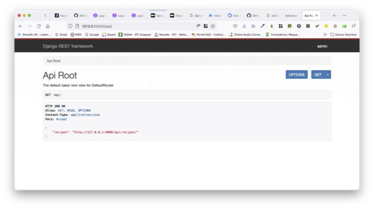
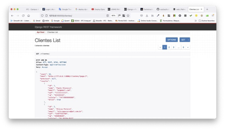
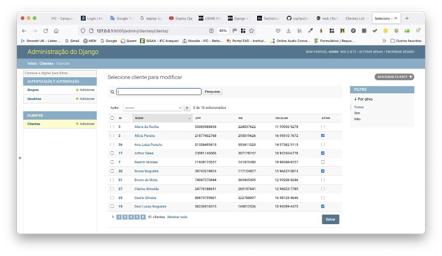
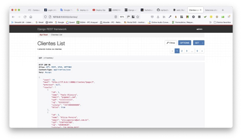
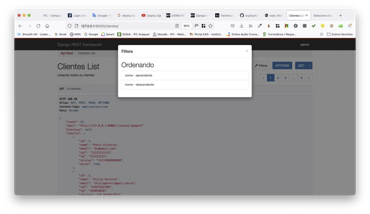
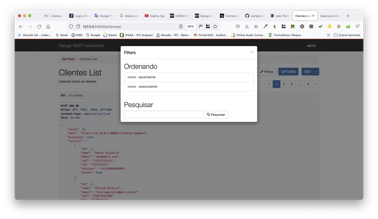
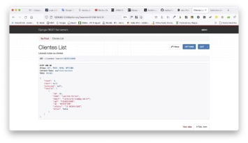
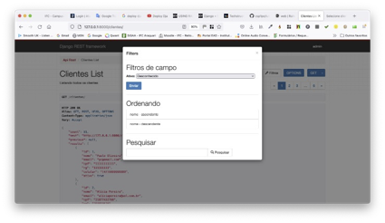
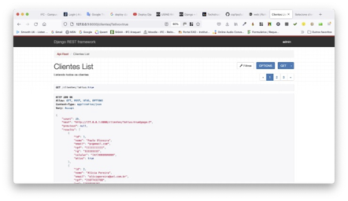

# Tutorial Django REST 06 – Inserindo Paginação, Ordenação, Busca e Filtro Na API de Clientes

No Tutorial anterior criamos vários clientes na nossa base de dados. Parece ótimo. Mas, e se pensarmos na usabilidade da nossa API? Ou seja, vamos listar todos os clientes de uma só vez na página? Isto não seria adequado. O ideal seria incluir uma paginação, que é algo semelhante ao que temos no “**Django Admin**”. De acordo com a documentação do [Django](https://docs.djangoproject.com/pt-br/5.0/topics/pagination/ "Recursos de Paginação no Django"), ele fornece algumas classes que ajudam a gerenciar dados paginados, ou seja, dados divididos em várias páginas, com links de “**Anterior**/**Próximo**”.

Neste tutorial vamos melhorar nossa API Clientes usando o conjunto completo de recursos do Django REST Framework (DRF), tais como paginação, ordenação, busca e filtro. 

Para isto, siga atentamente os passos abaixo.


**Observação Importante: somente o faça depois de fazer o Tutorial Django REST 05**


## **Passo 1: Configure seu ambiente de desenvolvimento**

Sempre que você estiver iniciando um projeto de desenvolvimento web, é uma boa ideia configurá-lo primeiro.

1.1) Abra o Terminal no VS Code. Primeiro digite (CTRL+Shift+P) e use a opção “**View: Toggle Terminal**” ou “**Ver: Alternar Terminal**”.

1.2) Digite na linha de comando do Terminal:

```
cd Django_Tutoriais
cd Tutorial_REST_05
```

1.3) Agora você precisa ativar o ambiente virtual criado no Tutorial anterior, executando o comando abaixo:

**Linux/Mac**

```
source clienv/bin/activate
```

**Windows**

```
.\clienv\Scripts\activate.bat
```

Ou

```
.\clienv\Scripts\Activate.ps1
```

Você saberá que seu ambiente virtual foi ativado, porque o _prompt_ do console no Terminal mudará. Deve ser assim:

```
(clienv) $
```


## **Passo 2: Testando seu servidor Django**


2.1) Depois que sua estrutura de arquivos estiver configurada, você pode iniciar o servidor de desenvolvimento que já vem embutido no Django. Para verificar se a configuração foi bem-sucedida, execute o seguinte comando no console do Terminal:

```
python manage.py runserver
```

Ao posicionar o mouse no link "http://127.0.0.1:8000/" você verá a seguinte mensagem:


No Windows irá aparecer “**Seguir o link (ctrl + click)**”. Ao efetuar esta operação, você será direcionado para uma aba do seu browser, e, se tudo estiver correto, você verá uma página da web como a da figura abaixo.




## **Passo 3: Configurando a paginação no DRF**


3.1) Abra o arquivo (“**config/settings.py**”) e adicione a seguinte linha de código abaixo no final do arquivo.

```python
REST_FRAMEWORK = {
    'DEFAULT_PAGINATION_CLASS': 'rest_framework.pagination.PageNumberPagination',
    'PAGE_SIZE': 10
} 
```

> Primeiramente estamos optando por exibir 10 clientes por página. Depois, podemos alterar este valor até encontrarmos um número que melhore a usabilidade da nossa API.


3.2) Agora vá para "http://127.0.0.1:8000/clientes". Veja a figura abaixo. 



> Observe que já foi incluída a paginação em nossa API no lado superior direito da página. Os números (1, 2, 3, etc.) representam as páginas onde estão listados os clientes. No nosso caso, dez (10) clientes por página. 
> 
> Ao olharmos atentamente para a listagem de clientes na nossa API, os clientes estão listados em ordem crescente de `ID`. Porém, gostaríamos que a ela fosse ordenada pelo nome do cliente (i.e. ordem alfabética).


## **Passo 4: Configurando a ordenação no módulo `admin` do Django**

4.1) Abra o arquivo “**admin.py**” no diretório (“**clientes/admin.py**”). Substitua o conteúdo do arquivo pelo seguinte código que está abaixo:

```python
# clientes/admin.py
from django.contrib import admin
from clientes.models import Cliente

class Clientes(admin.ModelAdmin):
    list_display = ('id', 'nome', 'cpf', 'rg', 'celular', 'ativo')
    list_display_links = ('id', 'nome')
    search_fields = ('nome',)
    list_filter = ('ativo',)
    list_editable = ('ativo',)
    list_per_page = 10
    ordering = ('nome',)

admin.site.register(Cliente, Clientes)
```

4.2) Agora vá para "http://127.0.0.1:8000/admin". Clique no link “**Clientes**” e observe que a listagem está em ordem alfabética de “**nome**”. Veja a figura abaixo.




## **Passo 5: Configurando a ordenação na API Clientes**

Agora queremos que a listagem da nossa API também esteja ordenada pelo nome do cliente. Na documentação do [Django REST Framework](https://www.django-rest-framework.org/api-guide/filtering/#djangofilterbackend "Filtering in DRF"), podemos incluir tanto a busca como a ordenação de uma API. No **Passo 8.1** do `Tutorial_Django_REST_05` executamos na linha de comando o comando abaixo. Caso não tenha feito, execute-o agora.

```
pip install django-filter
```

5.1) Abra o arquivo (“**config/settings.py**”) e adicione a seguinte linha de código em `INSTALLED_APPS`: (Não se esqueça de colocar a vírgula após a string).

```python
# config/settings.py
INSTALLED_APPS = [
    'django.contrib.admin',
    'django.contrib.auth',
    'django.contrib.contenttypes',
    'django.contrib.sessions',
    'django.contrib.messages',
    'django.contrib.staticfiles',
    'clientes',
    'rest_framework',
    'django_filters',
]
```

5.2) Abra o arquivo (“**clientes/views.py**”) e atualize o seu conteúdo.

```python
# clientes/views.py
from rest_framework import viewsets, filters
from clientes.serializers import ClienteSerializer
from clientes.models import Cliente
from django_filters.rest_framework import DjangoFilterBackend

class ClientesViewSet(viewsets.ModelViewSet):
    """Listando todos os clientes"""
    queryset = Cliente.objects.all()
    serializer_class = ClienteSerializer
    filter_backends = [DjangoFilterBackend, filters.OrderingFilter]
    ordering_fields = ['nome']
```

5.3) Agora vá para "http://127.0.0.1:8000/clientes/", e observe a figura abaixo. Existe um botão chamado `Filtros` que está antes dos botões `OPTIONS` E `GET`.



Ao clicar no botão `Filtros` vai aparecer uma caixa de diálogo (ver figura abaixo). Você pode escolher se quer ordenar em ordem ascendente de “**nome**” ou em ordem descendente. Ao escolher uma das opções, observe o nosso URL no navegador: "http://127.0.0.1:8000/clientes/?ordering=nome".




## **Passo 6: Configurando a busca e o filtro na API Clientes**

Vamos supor que eu queira pesquisar um determinado cliente pelo CPF dele. Como faço isso? Ou eu quero visualizar todos os clientes que estão ativos? Na documentação do DRF existe uma propriedade chamada [`SearchFilter`](https://www.django-rest-framework.org/api-guide/filtering/#searchfilter "Pesquisar no DRF").

6.1) Abra o arquivo (“**clientes/views.py**”) e atualize o seu conteúdo.

```python
# clientes/views.py
from rest_framework import viewsets, filters
from clientes.serializers import ClienteSerializer
from clientes.models import Cliente
from django_filters.rest_framework import DjangoFilterBackend

class ClientesViewSet(viewsets.ModelViewSet):
    """Listando todos os clientes"""
    queryset = Cliente.objects.all()
    serializer_class = ClienteSerializer
    filter_backends = [DjangoFilterBackend, filters.OrderingFilter, filters.SearchFilter]
    ordering_fields = ['nome']
    search_fields = ['nome']
```


6.2) Agora vá para "http://127.0.0.1:8000/clientes/". Depois clique no botão `Filtros` e observe a figura abaixo. Uma caixa de diálogo irá aparecer. Digite na caixa de texto `Pesquisar` um nome de um cliente qualquer.




6.3) Abra o arquivo (“**clientes/views.py**”) e atualize o seu conteúdo.

```python
# clientes/views.py
from rest_framework import viewsets, filters
from clientes.serializers import ClienteSerializer
from clientes.models import Cliente
from django_filters.rest_framework import DjangoFilterBackend

class ClientesViewSet(viewsets.ModelViewSet):
    """Listando todos os clientes"""
    queryset = Cliente.objects.all()
    serializer_class = ClienteSerializer
    filter_backends = [DjangoFilterBackend, filters.OrderingFilter, filters.SearchFilter]
    ordering_fields = ['nome']
    search_fields = ['nome','cpf']
```

> Basta incluir `cpf` no comando `search_fields = ['nome','cpf']`. Com isto podemos efetuar uma busca também pelo campo `cpf` do cliente. Observe a figura abaixo. Efetuei uma busca pelo `cpf` com o número "**31536114405**".



E se eu quisesse que a nossa API tivesse um filtro por clientes ativos e não ativos? Este tipo é chamado de **filtro de campo**. É o que faremos no próximo passo.


6.4) Abra o arquivo (“**clientes/views.py**”) e atualize o seu conteúdo.

```python
# clientes/views.py
from rest_framework import viewsets, filters
from clientes.serializers import ClienteSerializer
from clientes.models import Cliente
from django_filters.rest_framework import DjangoFilterBackend

class ClientesViewSet(viewsets.ModelViewSet):
    """Listando todos os clientes"""
    queryset = Cliente.objects.all()
    serializer_class = ClienteSerializer
    filter_backends = [DjangoFilterBackend, filters.OrderingFilter, filters.SearchFilter]
    ordering_fields = ['nome']
    search_fields = ['nome','cpf']
    filterset_fields = ['ativo']
```

6.5) Agora vá para "http://127.0.0.1:8000/clientes/". Depois clique no botão `Filtros` e observe a figura abaixo. Uma caixa de diálogo irá aparecer. Uma nova opção aparece: `Filtros de campo`, onde você pode selecionar se quer buscar clientes ativos ou não.



Vamos supor que desejamos listar somente os clientes ativos. Clique na lista de opções para “**Sim**” e depois no botão `Enviar`. Você verá a figura abaixo.



> Somente os clientes “**ativos**” serão listados na página da nossa API.

Neste tutorial vimos várias coisas. São elas:

* como ordenar os campos da API de forma ascendente e descendente; 
* como incluir paginação e filtros nos campos e desenvolvemos a busca de clientes pelo número de CPF ou pelo nome. Este é um recurso muito poderoso, pois ele aumenta a funcionalidade dela (i.e. API).

