# Tutorial Django REST 03 - Como Aplicar Permissões (Autorizações) Para Proteger Nossa Blog API

A segurança é uma parte importante de qualquer site, mas é duplamente importante com as APIs Web. Atualmente, a nossa API, construída no Tutorial anterior, permite acesso total a qualquer pessoa. Não há restrições. E qualquer usuário pode fazer qualquer coisa que seja extremamente perigosa. Por exemplo, um usuário anônimo pode criar, ler, atualizar ou excluir qualquer postagem do Blog. Mesmo um “**post**” que eles não criaram! Claramente não queremos isso.

O Django REST Framework vem com várias configurações de permissões prontas para uso que podemos usar para proteger nossa API. Eles podem ser aplicados em nível de projeto, nível de exibição ou em qualquer nível de modelo individual.
Neste tutorial, adicionaremos um novo usuário e experimentaremos várias configurações de permissões. Em seguida, criaremos nossa própria permissão personalizada para que apenas o autor de uma postagem do Blog tenha a capacidade de atualizá-la ou excluí-la. Para isto, siga **atentamente** os passos abaixo.


**Observação Importante: somente o faça depois de fazer o Tutorial Django REST 02**


## **Passo 1: Configure seu ambiente de desenvolvimento**

Sempre que você estiver iniciando um projeto de desenvolvimento web, é uma boa ideia configurá-lo primeiro.

1.1) Abra o Terminal no VS Code. Primeiro digite (CTRL+Shift+P) e use a opção “**View: Toggle Terminal**” ou “**Ver: Alternar Terminal**”.

1.2) Digite na linha de comando do Terminal:

```
cd Django_Tutoriais
cd Tutorial_REST_02
```

1.3) Agora você precisa ativar o ambiente virtual criado no Tutorial anterior, executando o comando abaixo:

**Linux/Mac**

```
source blogenv/bin/activate
```

**Windows**

```
.\blogenv\Scripts\activate.bat
```

Ou

```
.\blogenv\Scripts\Activate.ps1
```

Você saberá que seu ambiente virtual foi ativado, porque o _prompt_ do console no Terminal mudará. Deve ser assim:

```
(blogenv) $
```


## **Passo 2: Criando um usuário (`user`)**

Vamos começar criando um segundo usuário. Dessa forma, podemos alternar entre as duas contas de usuário para testar nossas configurações de permissões.

2.1) Reinicie o servidor no Terminal (`python manage.py runserver`), e no seu browser vá para "http://127.0.0.1:8000/admin". Você deverá ver a tela de login do administrador (“**admin**”) que está na figura abaixo:

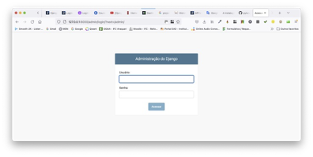


2.2) Faça o login inserindo o nome de usuário (`Username`) e a senha (`Password`) que você criou no **Passo 7.1** do Tutorial anterior. Você verá a página inicial do Django “**admin**” a seguir:

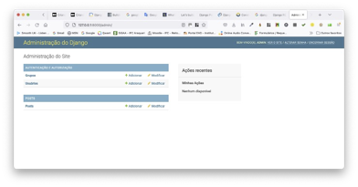


2.3) Agora clique no botão `+Add` (“**+Adicionar**”) que está do lado oposto de “**Usuários**” e digite um nome de usuário (`username`) e senha (`password`) para um novo usuário e clique no botão "**Salvar**". Eu escolhi o nome de usuário `testuser` aqui.

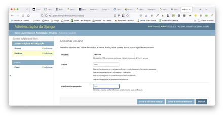


A próxima tela (ver figura abaixo) é a página chamada “**Admin User Change**”. Chamei meu usuário `testuser` e aqui pude adicionar informações adicionais incluídas no modelo de usuário padrão, como **nome**, **sobrenome**, **endereço de e-mail** etc. Mas nada disso é necessário para nossos propósitos: precisamos apenas de um **nome de usuário** e **senha** para teste.

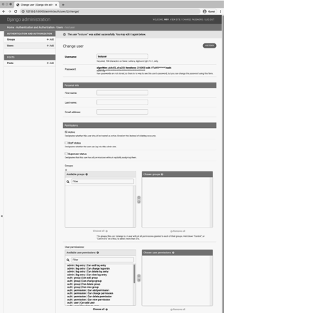


2.4) Desça até o final desta página e clique no botão "**Salvar**". O Django irá redirecionar de volta para a página principal de usuários em "http://127.0.0.1:8000/admin/auth/user/". Ver figura abaixo.

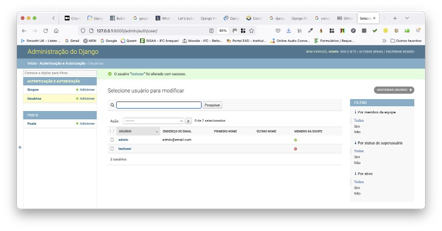


> Podemos ver que nossos dois usuários estão listados na página acima.


## **Passo 3: Adicionar login à API navegável**

Daqui para frente, sempre que quisermos alternar entre as contas de usuário, precisaremos entrar no módulo “**admin**” do Django, para termos, a cada vez, sair de uma conta e entrar em outra. E em seguida, voltar para o nosso endpoint da API.

Esta é uma ocorrência tão comum que o Django REST Framework possui uma configuração de uma linha para adicionar **login** e **logout** diretamente à própria API navegável. Vamos implementar isso agora.


3.1) Abra o arquivo “**urls.py**” no diretório (“**config/urls.py**”). Substitua o código abaixo nele. 

```python
# config/urls.py
from django.contrib import admin 
from django.urls import include, path

urlpatterns = [
    path('admin/', admin.site.urls),
    path('api/v1/', include('posts.urls')),
    path('api-auth/', include('rest_framework.urls')),
]
```

3.2) Agora vá para "http://127.0.0.1:8000/api/v1/". Há uma mudança sutil: ao lado do nome de usuário no canto superior direito (no nosso caso, aparecerá o usuário `admin`), há uma pequena seta voltada para baixo. Ver figura abaixo.


> **Observação**: como estamos logados com nossa conta de `superuser` neste momento (**admin** para mim), esse nome aparece. Clique no link e um menu suspenso com “**Log out**” aparecerá. Clique nele.
> 
> O link superior direito agora muda para “**Log in**”. Então clique nele. Somos redirecionados para a página de **login** do Django REST Framework (DRF). Veja a figura abaixo. Use nossa conta `testuser` aqui.

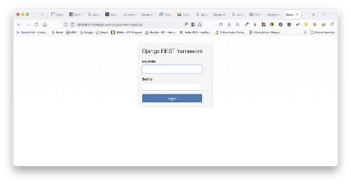

O DRF finalmente nos redirecionará de volta à página principal da API, onde `testuser` está presente no canto superior direito. Ver figura abaixo.


3.3) Como passo final, efetue o “**Log out**” da conta `testuser`. Você deve ver o link “**Log in**” no canto superior direito novamente.

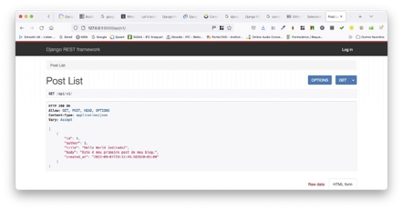

> Atualmente, qualquer usuário anônimo não autorizado pode acessar nosso **endpoint** com a listagem das postagens (`PostList`). 
> 
> Sabemos disso porque, embora não estejamos logados, podemos ver nossa única postagem no Blog. Pior ainda, qualquer pessoa tem acesso total para criar, editar, atualizar ou excluir uma postagem!
> 
> E na página de detalhes em "http://127.0.0.1:8000/api/v1/1/" as informações também são visíveis e qualquer usuário aleatório pode atualizar ou excluir uma postagem existente. E isto não é bom. Veja a figura abaixo.

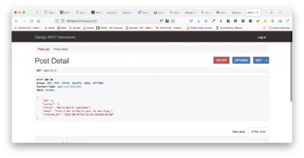


> A razão pela qual ainda podemos ver os **endpoints** da `PostList` e da `PostDetail` é que anteriormente definimos as permissões de nível de projeto para `AllowAny` no **Passo 9.3** do Tutorial anterior. Como um breve lembrete, o conteúdo do arquivo ficou assim:

```python
# config/settings.py
REST_FRAMEWORK = {
    'DEFAULT_PERMISSION_CLASSES': [
        'rest_framework.permissions.AllowAny',
    ]
}
```


## **Passo 4: Incluindo Permissões de Nível de Visualização (View-Level)**

O que queremos agora é restringir o acesso à API somente para usuários autenticados. Existem vários lugares em que podemos fazer isso, isto é, em nível de projeto, em nível de visualização ou nível de objeto. Mas como temos apenas duas visualizações (i.e. “**views**”) no momento, vamos começar por aí e adicionar permissões a cada uma delas.

4.1) Abra o arquivo ("**posts/views.py**") e substitua o seu conteúdo (veja o destaque)::

```
# posts/views.py
from rest_framework import generics, permissions
from .models import Post
from .serializers import PostSerializer

class PostList(generics.ListCreateAPIView): 
	permission_classes = (permissions.IsAuthenticated,)
	queryset = Post.objects.all()
	serializer_class = PostSerializer

class PostDetail(generics.RetrieveUpdateDestroyAPIView):
	permission_classes = (permissions.IsAuthenticated,)
	queryset = Post.objects.all()
	serializer_class = PostSerializer
```

4.2) Isso é tudo que precisamos. Atualize a API navegável em "http://127.0.0.1:8000/api/v1/". Observe o que aconteceu! (Veja a figura abaixo).

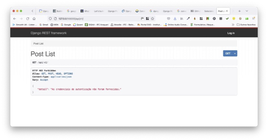

> Não vemos mais nossa página de lista de postagens. Em vez disso, somos recebidos com um código de status "**HTTP 403 Forbidden**" nada amigável, pois não estamos logados. 
> 
> Observe também a outra mensagem: “**detail**": "**As credenciais de autenticação não foram fornecidas.**”. E veja que também não há formulários na API navegável para editar os dados, pois não temos permissão, ou seja, não temos autorização.


4.3) Se você usar o URL para `PostDetail` que é: "http://127.0.0.1:8000/api/v1/1/", você verá mensagens semelhantes e nenhum formulário disponível para edição (ver figura abaixo).

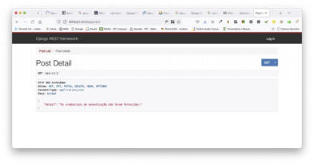

> Portanto, neste momento, apenas usuários logados podem visualizar nossa API. Se você fizer login novamente com sua conta `admin` ou `testuser`, os **endpoints** dela estarão acessíveis.
> 
> Mas pense no que acontece à medida que a API cresce em complexidade. É provável que tenhamos muito mais “**views**” e **endpoints** no futuro. 
> 
> Adicionar um `permission_classes` dedicado a cada visualização parece repetitivo se quisermos definir a mesma configuração de permissões em toda a nossa API.
> 
> Não seria melhor alterar nossas permissões uma vez, idealmente em nível de todo o projeto, em vez de fazer isso para cada “**view**”?


## **Passo 5: Incluindo Permissões de Nível de Projeto (Project-Level)**

Esta é uma abordagem muito mais simples e segura. Ou seja, definir uma política de permissões estrita no nível do projeto e “afrouxá-la” conforme necessário no nível da visualização (“**view**”). E é exatamente isto é o que faremos.

Felizmente, o Django REST Framework vem com várias configurações de permissões em nível de projeto incorporadas que podemos usar, incluindo:

* [`AllowAny`](https://www.django-rest-framework.org/api-guide/permissions/#allowany)  – qualquer usuário, autenticado ou não, tem acesso total
* [`IsAuthenticated`](https://www.django-rest-framework.org/api-guide/permissions/#isauthenticated)  – apenas usuários autenticados e registrados têm acesso
* [`IsAdminUser`](https://www.django-rest-framework.org/api-guide/permissions/#isadminuser)  – apenas administradores/superusuários (admin/superusers) têm acesso
* [`IsAuthenticatedOrReadOnly`](https://www.django-rest-framework.org/api-guide/permissions/#isauthenticatedorreadonly)  – usuários não autorizados podem visualizar qualquer página, mas somente aqueles autenticados têm privilégios de gravação, edição ou exclusão.

A implementação de qualquer uma dessas quatro configurações acima requer a atualização do parâmetro que se encontra no arquivo (“**config/settings.py**”). É o `DEFAULT_PERMISSION_CLASSES` e depois dar o “refresh” do navegador. É isso!


5.1) Abra o arquivo “**config/settings.py**”, e substitua o conteúdo dele (veja o destaque):

```python
# config/settings.py
REST_FRAMEWORK = {
    'DEFAULT_PERMISSION_CLASSES': [
        'rest_framework.permissions.IsAuthenticated',
    ]
}
```


5.2) Abra o arquivo na pasta “**posts**” chamado “**posts/views.py**”. Substitua o código dele conforme abaixo.

```python
# posts/views.py
from rest_framework import generics 
from .models import Post
from .serializers import PostSerializer

class PostList(generics.ListCreateAPIView): 
	queryset = Post.objects.all() 
	serializer_class = PostSerializer

class PostDetail(generics.RetrieveUpdateDestroyAPIView): 
	queryset = Post.objects.all()
	serializer_class = PostSerializer
```

> Se você atualizar as páginas `PostList` e `DetailList`, ainda verá o mesmo código de status 403. Agora, exigimos que todos os usuários se autentiquem antes que possam acessar a API, mas também sempre podemos fazer alterações adicionais no nível de visualização (“**view-level**”), conforme necessário.


## **Passo 6: Criando Permissões Personalizadas**

Agora chegou a hora da nossa primeira permissão personalizada. Como uma breve recapitulação de onde estamos agora: temos dois usuários: `testuser` e a conta `superuser`. Há uma postagem no nosso Blog que foi criada por ele (i.e. “superuser”).

Queremos que apenas o autor de uma postagem específica possa editá-la ou excluí-la. Caso contrário, ela deve ser para leitura somente. Portanto, a conta `superuser` deve ter acesso CRUD completo à instância individual do Blog, mas o usuário `testuser` não. 

Primeiro, pare o servidor local com “Control+C”.


6.1) Crie um arquivo na pasta “**posts**” chamado “**posts/permissons.py**”. Adicione o código abaixo.

```python
# posts/permissions.py
from rest_framework import permissions

class IsAuthorOrReadOnly(permissions.BasePermission):
    
	def has_object_permission(self, request, view, obj):
		# Read-only permissions are allowed for any request
		# Permissões somente leitura são permitidas 
		# para qualquer requisição
		if request.method in permissions.SAFE_METHODS:
			return True

		# Write permissions are only allowed to the author of a pos
		# As permissões de escrita são permitidas apenas 
		# ao autor de uma postagem
		return obj.author == request.user
```

> No arquivo acima Importamos o módulo “**permissions**”. Em seguida, criamos uma classe personalizada chamada `IsAuthorOrReadOnly` que estende (herda) `BasePermission`. Em seguida, sobrescrevemos o método `has_object_permission`. 
> 
> Se uma requisição contém verbos HTTP incluídos em SAFE_METHODS (que é uma tupla contendo `GET`, `OPTIONS` e `HEAD`), então é uma requisição somente para leitura e a permissão é concedida.
> 
> Caso contrário, a requisição é para uma escrita de algum tipo, o que significa atualizar o recurso da API para criar, excluir ou editar a funcionalidade. Nesse caso, verificamos se o autor do objeto em questão, que é nosso “**post**” do Blog chamado `obj.author`, corresponde ao usuário que está fazendo a requisição `request.user`.


6.2) Abra o arquivo na pasta “**posts**” chamado “**posts/views.py**”. Adicione o código abaixo (em destaque).

```python
# posts/views.py
from rest_framework import generics
from .models import Post
from .permissions import IsAuthorOrReadOnly # new 
from .serializers import PostSerializer

class PostList(generics.ListCreateAPIView): 
	queryset = Post.objects.all() 
	serializer_class = PostSerializer

class PostDetail(generics.RetrieveUpdateDestroyAPIView):   
	permission_classes = (IsAuthorOrReadOnly,)  # new
	queryset = Post.objects.all()
	serializer_class = PostSerializer
```

6.3) E terminamos. Vamos testar as coisas. Execute o comando para carregar o servidor de desenvolvimento: `python manage.py runserver`. Navegue até a página `PostDetail`, localizada em "http://127.0.0.1:8000/api/v1/1/". Verifique se você está logado com sua conta de `superuser`, que é o autor da postagem. O nome de usuário deve estar visível no canto superior direito da página (`admin` no meu caso). Veja a figura abaixo.


No entanto, se você se deslogar e fizer login com a conta `testuser`, a página será alterada. Veja a figura abaixo.

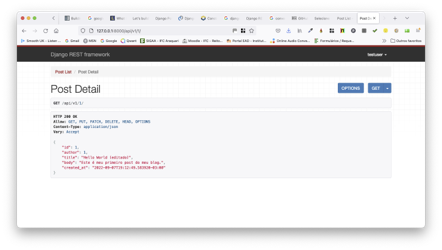


Podemos visualizar esta página, pois as permissões somente de leitura são permitidas. No entanto, não podemos fazer quaisquer requisições do tipo `PUT` ou `DELETE` devido à nossa classe de permissão `IsAuthorOrReadOnly` que foi personalizada (i.e. customizada).

Definir permissões adequadas é uma parte muito importante de qualquer API. Como estratégia geral, é uma boa ideia definir uma política estrita de permissões no nível do projeto, de modo que apenas usuários autenticados possam visualizá-Ia. Em seguida, torne as permissões personalizadas ou em nível de visualização (“**view-level**”) mais acessíveis conforme necessário, em **endpoints** específicos da API.
