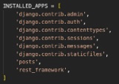
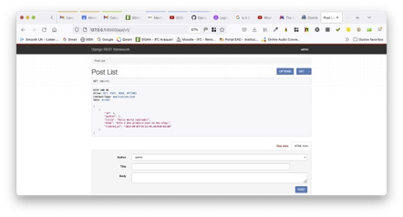

# Tutorial Django REST 02 – Criando Uma Aplicação Web de um Blog e sua API

Neste tutorial vamos construir uma Blog API usando o conjunto completo de recursos do **Django REST Framework**. Ele terá usuários, permissões e permitirá a funcionalidade completa de CRUD (*Create-Read-Update-Delete*). Para isto, siga atentamente os passos abaixo.

**Observação Importante: somente o faça depois de fazer o Tutorial Django 01**

## **Passo 1: Configure seu ambiente de desenvolvimento**

Sempre que você estiver iniciando um projeto de desenvolvimento web, é uma boa ideia configurá-lo primeiro.

1.1) Abra o Terminal no VS Code. Primeiro digite (CTRL+Shift+P) e use a opção “**View: Toggle Terminal**” ou “**Ver: Alternar Terminal**”.

1.2) Digite na linha de comando do Terminal:

```
cd Django_Tutoriais
mkdir Tutorial_REST_02
cd Tutorial_REST_02
```

1.3) Uma vez dentro do diretório `Tutorial_REST_02`, crie um ambiente virtual. Para isto, digite o comando a seguir:

```
python3 -m venv blogenv
```

1.4) Agora você precisa ativar o ambiente virtual criado no item anterior, executando o comando abaixo:

**Linux/Mac**

```
source blogenv/bin/activate
```

**Windows**

```
.\blogenv\Scripts\activate.bat
```

Ou

```
.\blogenv\Scripts\Activate.ps1
```

Você saberá que seu ambiente virtual foi ativado, porque o _prompt_ do console no Terminal mudará. Deve ser assim:

```
(blogenv) $
```

1.5) Agora que você criou um ambiente virtual, é hora de instalar o **Django**. Digite na linha de comando:

```
(blogenv) $ pip install django
```

## **Passo 2: Criando seu projeto em Django**

2.1) Certifique-se de que você está dentro do diretório `Tutorial_REST_02` e o ambiente virtual ativado. Agora, digite o comando abaixo para criar um projeto.

```
(blogenv) $ django-admin startproject config .
```

>**Observação: ao criar um novo projeto Django chamado “config” certifique-se de incluir o ponto (.) no final do comando para que ele seja instalado no diretório atual.**

O comando acima irá criar uma pasta chamada “**config**” contendo alguns arquivos. No painel esquerdo do **VS Code**, você verá uma estrutura de diretório que se parece com a figura abaixo.


## **Passo 3: Testando seu servidor Django**

3.1) Depois que sua estrutura de arquivos estiver configurada, você pode iniciar o servidor de desenvolvimento que já vem embutido no Django. Para verificar se a configuração foi bem-sucedida, execute o seguinte comando no console do Terminal:

```
python manage.py runserver
```
Ao posicionar o mouse no link "http://127.0.0.1:8000/" você verá a seguinte mensagem:

3.2) Observe no console do Terminal as mensagens da figura abaixo:


No **Windows** irá aparecer “**Seguir o link (ctrl + click)**”. Ao efetuar esta operação, você será direcionado para uma aba do seu browser, e, se tudo estiver correto, você verá uma página da web como a da figura abaixo.


3.3) Parabéns, você acabou de criar um projeto, nossa configuração está correta e você o testou no servidor de desenvolvimento. Agora o Django está pronto para começarmos a desenvolver.

## **Passo 4: Criando uma aplicação em Django**

Para esta parte do tutorial, criaremos uma “**app**” chamada “**books**”.

4.1) Para criar uma “**app**”, execute o seguinte comando:

```
python manage.py startapp posts
```

Este comando irá criar um diretório chamado “**books**” com vários arquivos. Veja a estrutura na figura abaixo.


4.2) Agora que você criou a "**app**", temos que “instalá-la” no seu projeto. Abra o arquivo ("**config/settings.py**") e adicione a seguinte linha de código destacada em `INSTALLED_APPS`: (**Não se esqueça de colocar a vírgula após a _string_**).


Essa linha de código indica que seu projeto agora sabe que o aplicativo que você acabou de criar existe.

Surge uma pergunta: de onde obtivemos a referência a “**posts**”?

Resposta: quando criamos uma nova “**app**”, no **Passo 4.1**, o Django gerou um arquivo chamado “**apps.py**” na pasta “**posts**”. E dentro desse arquivo, ele criou uma classe chamada `PostsConfig`. Essa classe nos permite fazer referência ao aplicativo (i.e. “**app**”) para o projeto. O conteúdo do arquivo “**posts/apps.py**” está abaixo.

```python
from django.apps import AppConfig
class PostsConfig(AppConfig):
	default_auto_field = 'django.db.models.BigAutoField'
	name = 'posts'
```

4.3) Neste mesmo arquivo ("**config/settings.py**") procure pelo comentário “**#Internationalization**” e altere as configurações para `LANGUAGE_CODE` e `TIME_ZONE`. Veja a figura abaixo. 


## **Passo 5: Criando um Banco de Dados**

5.1)	Na linha de comando do VS Code, digite o seguinte comando:

```python
python manage.py migrate
```

O comando “**migrate**” acima serve para criar um Banco de Dados (BD) inicial com base nas configurações padrões do Django.

Se você olhar dentro do nosso diretório com o comando “ls”, verá que agora existe um arquivo chamado “**db.sqlite3**” que representa esse BD. Por padrão, o Django utiliza o SQLite.

[SQLite Website](https://www.sqlite.org/index.html "SQLite Website")
 

Tecnicamente, um arquivo “**db.sqlite3**” é criado na primeira vez que você executa o comando `python manage.py migrate` (**Passo 5.1** acima) ou o comando `python manage.py runserver`. (**Passo 3.1** também acima).

Entretanto, “**migrate**” irá sincronizar o Banco de Dados com o estado atual de quaisquer modelos (“models”) de BD contidos no projeto e listados em “INSTALLED_APPS” (**Passo 4.2**). 

Em outras palavras, para garantir que o BD reflita o estado atual do seu projeto, você precisará executar o comando “migrate” (e também o comando “**makemigrations**”) cada vez que atualizar um “model”. Este último, veremos em um passo futuro.

5.2) 	Agora, para confirmar se tudo está funcionando corretamente, reinicie nosso servidor no Terminal (`python manage.py runserver`), e visite "http://127.0.0.1:8000". Você deverá a seguinte página da web:


## **Passo 6: Criando um Modelo (“Model”) de Banco de Dados**

6.1) Abra o arquivo "**models.py**" no diretório ("**books/models.py**"). Já existe uma linha de código lá que importa um módulo chamado "**models**". Este módulo nos ajuda a construir novos modelos, os quais irão “modelar” as características dos dados no nosso BD. 

```python
from django.db import models
# Create your models here
```


Agora adicione o seguinte código a este arquivo (em destaque):

```python
# posts/models.py
from django.db import models
from django.contrib.auth.models import User

class Post(models.Model):
	author = models.ForeignKey(User, on_delete=models.CASCADE)
	title = models.CharField(max_length=50)
	body = models.TextField()
	created_at = models.DateTimeField(auto_now_add=True)
	updated_at = models.DateTimeField(auto_now=True)

	def __str__(self): 
		return self.title

```

> Observe que também estamos definindo qual deve ser a representação `__str__` do “model”, que é uma prática recomendada do Django. Dessa forma, veremos o título em nosso módulo “admin” do Django mais tarde.
> 
> Agora atualize nosso Banco de Dados criando primeiro um arquivo de migração e, em seguida, executando o comando `migrate` para sincronizá-lo com nossas alterações do “**model**”.


6.2)	Certifique-se de que o servidor local esteja parado digitando “**Control+C**” na linha de comando e, em seguida, execute os comandos abaixo: 

```python
python manage.py makemigrations posts
```

Você verá a seguinte mensagem:

```python
Migrations for 'posts':
  posts/migrations/0001_initial.py
    - Create model Post
```

Agora execute este comando:

```python
python manage.py migrate
```

As mensagens serão estas:

```python
Operations to perform:
  Apply all migrations: admin, auth, contenttypes, posts, sessions
Running migrations:
  Applying posts.0001_initial... OK
```


## **Passo 7: Configurando o Módulo `Admin` do Django**

Um dos recursos matadores do Django é sua interface de administração já embutida que fornece uma maneira visual de interagir com os dados. Ela surgiu porque o Django foi originalmente construído como um CMS (_Content Management System_ – Sistema de Gerenciamento de Conteúdo) de um jornal. 

A ideia era que os jornalistas pudessem escrever e editar suas histórias no módulo “**admin**” sem precisar mexer no "código". 

Com o tempo, este aplicativo administrativo integrado evoluiu para uma ferramenta fantástica e pronta para uso para gerenciar todos os aspectos de um projeto Django. 


7.1) Para usar o Django “**admin**”, primeiro precisamos criar um super usuário (`superuser`) que possa fazer login. No console da linha de comando, digite o comando abaixo e responda aos prompts de nome de usuário (`Username`), e-mail (`Email`) e senha (`Password`):
 
```python
python manage.py createsuperuser
```

Os _prompts_ estão descritos abaixo. Os valores digitados (em destaque) são ilustrativos. Escolha o mais adequado ao seu caso:

```python
Username (leave blank to use 'wsv'): admin
Email: admin@learndjango.com
Password:
Password (again):
Superuser created successfully.
```

> **Observação importante: Ao digitar sua senha, ela não aparecerá visível no console da linha de comando por motivos de segurança.**

7.2) Agora, reinicie o servidor no Terminal (`python manage.py runserver`), e no seu browser visite "http://127.0.0.1:8000/admin'. Você deverá ver a tela de login do administrador (“**admin**”) que está na figura abaixo:


7.3) Faça o login inserindo o nome de usuário (`Username`) e a senha (`Password`) que você acabou de criar no **Passo 7.1**. Você verá a página inicial do Django “**admin**” a seguir:


Surge uma pergunta: onde está nosso “**app**” de “**posts**”? Ele não é exibido na página principal do administrador! Assim como devemos adicionar explicitamente novos aplicativos à configuração `INSTALLED_APPS`, também devemos atualizar o arquivo `admin.py` do nosso aplicativo para que ele apareça no módulo administrador (i.e. “Django admin”).

7.4) Abra o arquivo "**admin.py**" no diretório ("**posts/admin.py**"), e adicione o seguinte código para que o “**model**” “**Post**” seja exibido.

```python
# posts/admin.py
from django.contrib import admin 
from .models import Post 

admin.site.register(Post)
```

Agora, o Django sabe que deve exibir nosso “app” de “**posts**” e o seu “**model**” (modelo) de BD chamado “**Post**” na página do “admin”. Se você atualizar seu browser (navegador), verá que ele aparece:


7.5) Agora vamos criar um “**post**” para nosso Blog. Clique no botão `+Add` (“**+Adicionar**”) que está do lado oposto de “**Posts**” e insira os dados nos campos indicados na figura abaixo. Você pode entrar com quaisquer valores.


7.6) Em seguida, clique no botão “**Save**” (“Salvar”), que o redirecionará para a página principal de “**Posts**”. A figura abaixo irá aparecer.


## **Passo 8: Criando um módulo de teste para nosso “model”**

Vamos escrever um teste básico para nosso “**model**” “**Post**”. Precisamos garantir que um usuário logado possa criar uma postagem para o blog com `title` e `body`.

8.1) Abra o arquivo "**tests.py**" no diretório (“**posts/tests.py**”). Substitua o código abaixo nele. 

```python
# posts/tests.py
from django.test import TestCase
from django.contrib.auth.models import User 
from .models import Post

class BlogTests(TestCase):
	@classmethod
	def setUpTestData(cls): 
  		# Create a user
  		testuser1 = User.objects.create_user(
		username='testuser1', password='abc123')
		testuser1.save()
        
		# Create a blog post
		test_post = Post.objects.create(author=testuser1, title='Blog title', body='Body content...')
		test_post.save()

		def test_blog_content(self):
			post = Post.objects.get(id=1)
			author = f'{post.author}'
			title = f'{post.title}'
			body = f'{post.body}' 
			self.assertEqual(author, 'testuser1')
			self.assertEqual(title, 'Blog title') 
			self.assertEqual(body, 'Body content...')
```

8.2) Para confirmar que nossos testes estão funcionando, saia do servidor local com “Control+C”. Em seguida, execute nossos testes. Na linha de comando digite o comando abaixo:

```
python manage.py test
```

Você deverá ver a mensagem abaixo, que confirma que tudo está funcionando conforme o esperado.

```
Found 1 test(s).
Creating test database for alias 'default'...
System check identified no issues (0 silenced).
.
----------------------------------------------------------------------
Ran 1 test in 0.353s

OK
Destroying test database for alias 'default'...
```

Nós terminamos agora com a parte regular do Django. Tudo o que realmente precisamos é de um “**model**” e alguns dados em nosso BD. E agora é hora de adicionar o Django REST Framework (DRF) para cuidar de transformá-los em uma API.

Como vimos antes, o DRF cuida do trabalho pesado de transformar nossos “**models**” de BD em uma API RESTful. Existem três etapas principais nesse processo:

* arquivo “**urls.py**” para as rotas de URL
* arquivo “**serializers.py**” para transformar os dados em JSON 
* arquivo “**views.py**” para aplicar a lógica a cada “**endpoint**” da API

---


## **Passo 9: Incluindo o Django REST Framework**

Django REST Framework é adicionado como qualquer outro aplicativo adicional. Certifique-se de encerrar o servidor local com “**Control+C**” se ele ainda estiver em execução. 

9.1) Em seguida, na linha de comando, digite os três comandos abaixo:

```python
(blogenv) $ pip install djangorestframework
(blogenv) $ pip install markdown
(blogenv) $ pip install django-filter
```

9.2) Abra o arquivo ("**config/settings.py**") e adicione a seguinte linha de código abaixo em `INSTALLED_APPS`: (Não se esqueça de colocar a vírgula após a string).



Também é uma boa ideia definir explicitamente nossas permissões que por padrão no Django REST Framework são configuradas para `AllowAny`.


9.3) Ainda no arquivo (“**config/settings.py**”) adicione a seguinte linha de código no fim dele (em destaque):

```python
# new
REST_FRAMEWORK = {
    'DEFAULT_PERMISSION_CLASSES': [
        'rest_framework.permissions.AllowAny',
    ]
}
```

---
## **Passo 10: Adicionando os URLs da API**

Vamos começar com as rotas de URL para a localização real dos “**endpoints**”. Para isto vamos atualizar o arquivo “**config/urls.py**” com a importação de inclusão (`import include`) na segunda linha e uma nova rota “**api/v1/**” para nosso aplicativo de postagens (“**posts app**”).

10.1) Abra o arquivo "**config/urls.py**" , e altere o conteúdo dele:

```python
# config/urls.py
from django.contrib import admin
from django.urls import include, path
urlpatterns = [
    path('admin/', admin.site.urls),
    path('api/v1/', include('posts.urls')),
]
```

> É uma boa prática sempre definir versões para as APIs (v1/, v2/, etc), pois quando você faz uma grande alteração, pode haver algum tempo de atraso antes que vários usuários desta API também possam atualizar. Dessa forma, você pode oferecer suporte a uma “v1” por um determinado período, ao mesmo tempo em que lança uma nova “v2” atualizada e evita interromper outros aplicativos que dependem do back-end dela (i.e. API).
> 
> Observe que, como nosso único “**app**” neste momento são os “**posts**”, podemos incluí-lo diretamente aqui. Se tivéssemos vários aplicativos em um projeto, talvez fizesse mais sentido criar um aplicativo de API dedicado e incluir todas as outras rotas de URL nele. Mas para projetos básicos como este, é melhor evitar que um “**app**” seja usado apenas para roteamento. Podemos sempre adicionar um mais tarde, se necessário.


10.2) Crie um arquivo na pasta “**posts**” chamado “**posts/urls.py**”. Adicione o código abaixo.

```python
# posts/urls.py
from django.urls import path
from .views import PostList, PostDetail

urlpatterns = [
    path('<int:pk>/', PostDetail.as_view()),
    path('', PostList.as_view()),
]
```

> Todas as rotas do nosso blog estarão em **“api/v1/**”. Nossa “**view**” “**PostList**” (que escreveremos em um passo próximo) tem a string vazia ('') estará em “**api/v1/**”. Já a “**view**” “**PostDetail**” (também a ser escrita em um próximo passo) estará em “**api/v1/#**” onde `#` representa a chave primária da entrada. Por exemplo, a primeira postagem do blog tem um ID principal de 1, portanto, estará na rota “**api/v1/1**”, a segunda postagem na “api/v1/2” e assim por diante.

---
## **Passo 11: Criando os Serializers**

Um “**serializer**” converte dados em um formato fácil de usar na Internet. Normalmente o formato é **JSON**, e ele é exibido em um “**endpoint**” de API. Ou seja, ele serve para converter “**models**” do Django em **JSON**.

11.1) Crie um arquivo na pasta “**posts**” chamado “**posts/serializers.py**”. Adicione o código abaixo.

```python
# posts/serializers.py
from rest_framework import serializers 
from .models import Post

class PostSerializer(serializers.ModelSerializer):
	class Meta:
		fields = ('id', 'author', 'title', 'body', 'created_at',) 
		model = Post
```


> O “serializer” não apenas transforma dados em JSON, mas também pode especificar quais campos incluir ou excluir. No nosso caso, incluiremos o campo “id” que o Django adiciona automaticamente aos “**models**” de BD, mas excluiremos o campo `updated_at` ao não incluí-lo em nossos campos.
> 
> A capacidade de incluir/excluir campos em nossa API com facilidade é um recurso notável. Na maioria das vezes, um “model” a ser usado terá muito mais campos do que o que precisa ser exposto. A poderosa classe “serializer” do Django REST Framework torna extremamente simples controlar isso.
> 
> No início do arquivo, importamos a classe “**serializers**” do DRF e nossos próprios “**models**”. Em seguida, criamos uma classe chamada `PostSerializer` e adicionamos a ela uma outra classe chamada `Meta` onde especificamos quais campos desejamos incluir e definimos explicitamente o modelo a ser usado. Há muitas maneiras de personalizar um “**serializer**”, mas para casos de uso comuns, como um Blog básico, isso é tudo o que precisamos.


---
## **Passo 12: Criando as Views da API**

O passo final é criar nossas “**views**”. O Django REST Framework tem várias “**views**” genéricas que são úteis. Já usamos a [`ListAPIView`](https://www.django-rest-framework.org/api-guide/generic-views/#listapiview "views genéricas DRF") no **Tutorial Django REST 01**, para criar uma coleção de endpoints somente para leitura (“read-only”), que é, essencialmente, uma lista de todas as instâncias de modelo. 


Para a API deste tutorial (**Blog**), queremos listar todas as postagens disponíveis como um **endpoint** de leitura e gravação (“read-write”), a qual é similar a `ListAPIView`, mas que permite “escritas” (write). Ela é chamada de [`ListCreateAPIView`](https://www.django-rest-framework.org/api-guide/generic-views/#listcreateapiview "views genéricas DRF"). 

Também queremos disponibilizar as postagens individuais do Blog para serem lidas, atualizadas ou excluídas. E com certeza, há uma visão genérica do DRF apenas para este propósito: [`RetrieveUpdateDestroyAPIView`](https://www.django-rest-framework.org/api-guide/generic-views/#retrieveupdatedestroyapiview "views genéricas DRF"). É essa que vamos usar neste tutorial.

12.1) Abra o arquivo “**posts/views.py**” e atualize seu conteúdo (em destaque):

```python
# posts/views.py
from rest_framework import generics 
from .models import Post
from .serializers import PostSerializer

class PostList(generics.ListCreateAPIView): 
	queryset = Post.objects.all() 
	serializer_class = PostSerializer

class PostDetail(generics.RetrieveUpdateDestroyAPIView): 
	queryset = Post.objects.all()
	serializer_class = PostSerializer
```

Nas primeiras linhas do arquivo editado acima, importamos o módulo `generics` do Django REST Framework, bem como nossos arquivos de “**models**” e “**serializers**”. Em seguida, criamos duas “**views**”. A `PostList` que usa o ”**generics**” `ListCreateAPIView` e o `PostDetail` que usa o `RetrieveUpdateDestroyAPIView`.

É incrível que tudo o que precisamos fazer é atualizar nossa “**view**” genérica para mudar radicalmente o comportamento de um determinado endpoint da API. Essa é a vantagem de usar um framework completo como o DRF: toda essa funcionalidade está disponível, testada e simplesmente funciona. Como desenvolvedores, não precisamos reinventar a roda aqui.

Ufa. Nossa API agora está completa e realmente não precisamos escrever muito código por conta própria. Faremos melhorias adicionais em nossa API nos próximos tutoriais, mas vale a pena reconhecer que ela já executa a lista básica e a funcionalidade CRUD que desejamos. Hora de testar as coisas com a API navegável do Django Rest Framework.


---


## **Passo 13: Visualizando os Serializers no Browser**

13.1) Agora, ao reiniciar o servidor no Terminal (`python manage.py runserver`), visite "http://127.0.0.1:8000/api/v1". Você deverá a seguinte página da web:



A página exibe uma lista dos posts de nosso Blog, que é apenas uma no momento, no formato JSON. Observe que os métodos `GET` e `POST` são permitidos.

Agora vamos confirmar que nosso endpoint de instância do “**model**”, que se relaciona a uma única postagem em vez de uma lista de todas as postagens, existe.

13.2)	Agora vá para "http://127.0.0.1:8000/api/v1/1/", e observe a figura abaixo.


Você pode ver no cabeçalho que `GET`, `PUT`, `PATCH` e `DELETE` são suportados, mas não `POST`. E, de fato, você pode usar o formulário HTML abaixo para fazer alterações ou até mesmo usar o botão vermelho `DELETE` para excluir a instância.

Vamos experimentar as coisas. Atualize nosso título (`title`) com o texto adicional (editado) no final. Em seguida, clique no botão `PUT`. (Veja a figura abaixo).


13.3) Volte para a visualização da lista de postagens clicando no link para ela na parte superior da página ou navegando diretamente para "http://127.0.0.1:8000/api/v1/" e você também poderá ver o texto atualizado.


Nossa Blog API está completamente funcional neste momento. No entanto, há um grande problema: qualquer pessoa pode atualizar ou excluir uma postagem existente! Em outras palavras, não temos nenhuma permissão em vigor. No próximo tutorial, aprenderemos como aplicar permissões para protegê-la.
