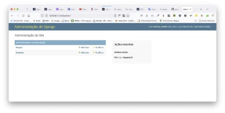

# Tutorial Django REST 09 - Criando Uma API Django REST e uma interface em Vue.JS no *frontend*

A criação de aplicativos Web modernos exige soluções Web modernas. Neste tutorial, vamos aprender como criar uma API no Django e configurar uma interface Vue.js para consumi-la, em termos de frontend. Construiremos um aplicativo que usa uma API baseada em Django e interfaces Vue.js interativas. Para isto, siga atentamente os passos abaixo.

Para isto, siga atentamente os passos abaixo.


## **Passo 1: Configure seu ambiente de desenvolvimento**

Sempre que você estiver iniciando um projeto de desenvolvimento web, é uma boa ideia configurá-lo primeiro.

1.1) Abra o Terminal no VS Code. Primeiro digite (CTRL+Shift+P) e use a opção “**View: Toggle Terminal**” ou “**Ver: Alternar Terminal**”.

1.2) Digite na linha de comando do Terminal:

```
cd Django_Tutoriais
mkdir Tutorial_REST_09
cd Tutorial_REST_09
```

1.3) Uma vez dentro do diretório (`Tutorial_REST_09`), crie um ambiente virtual. Para isto, digite o comando a seguir:

```
python3 -m venv recenv
```


1.4) Agora você precisa ativar o ambiente virtual criado no Tutorial anterior, executando o comando abaixo:

**Linux/Mac**

```
source recenv/bin/activate
```

**Windows**

```
.\recenv\Scripts\activate.bat
```

Ou

```
.\recenv\Scripts\Activate.ps1
```

Você saberá que seu ambiente virtual foi ativado, porque o _prompt_ do console no Terminal mudará. Deve ser assim:

```
(recenv) $
```

1.5) Agora que você criou um ambiente virtual, é hora de instalar o Django. Digite na linha de comando:

```
(recenv) $ pip install django
```


## **Passo 2: Criando seu projeto em Django**

2.1) Certifique-se de que você está dentro do diretório `Tutorial_REST_09` e o ambiente virtual ativado. Agora, para criar um projeto, digite o comando abaixo.

```
(recenv) $ django-admin startproject api .
```

> Observação: ao criar um novo projeto Django chamado “**recenv**” certifique-se de incluir o ponto (.) no final do comando para que ele seja instalado no diretório atual.
> 
> O comando acima irá criar uma pasta chamada “**recenv**” contendo alguns arquivos. No painel esquerdo do VS Code, você verá uma estrutura de diretório que se parece com a figura abaixo. 


## **Passo 3: Testando seu servidor Django**


3.1) Depois que sua estrutura de arquivos estiver configurada, você pode iniciar o servidor de desenvolvimento que já vem embutido no Django. Para verificar se a configuração foi bem-sucedida, execute o seguinte comando no console do Terminal:

```
python manage.py runserver
```

Ao posicionar o mouse no link "http://127.0.0.1:8000/" você verá a seguinte mensagem:


No Windows irá aparecer “**Seguir o link (ctrl + click)**”. Ao efetuar esta operação, você será direcionado para uma aba do seu browser, e, se tudo estiver correto, você verá uma página da web como a da figura abaixo.


## **Passo 4: Criando uma aplicação em Django**

Para esta parte do tutorial, criaremos uma “**app**” chamada “**core**”.

4.1) Para criá-la, execute o seguinte comando:

```
python manage.py startapp core
```

Este comando irá criar um diretório chamado “**core**” com vários arquivos. Veja a estrutura na figura abaixo.


4.2) Agora que você criou a “**app**”, temos que “instalá-la” no seu projeto. Abra o arquivo (“**api/settings.py**”) e adicione a string `core` em `INSTALLED_APPS`: (Não se esqueça de colocar a vírgula após a string).

```python
# api/settings.py
INSTALLED_APPS = [
    'django.contrib.admin',
    'django.contrib.auth',
    'django.contrib.contenttypes',
    'django.contrib.sessions',
    'django.contrib.messages',
    'django.contrib.staticfiles',
    'core',
]
```

> Essa linha de código indica que seu projeto agora sabe que o aplicativo que você acabou de criar existe. 

4.3) Neste mesmo arquivo (“**api/settings.py**”) procure pelo comentário `# Internationalization` e altere as configurações para `LANGUAGE_CODE` e `TIME_ZONE`. Veja a figura abaixo. 


## **Passo 5: Criando um Banco de Dados**

5.1) Na linha de comando digite o comando abaixo:

```
python manage.py migrate
```

> O comando “**migrate**” acima serve para criar um Banco de Dados (BD) inicial com base nas configurações padrões do Django.


5.2) Agora, para confirmar se tudo está funcionando corretamente, reinicie nosso servidor no Terminal (`python manage.py runserver`), e visite "http://127.0.0.1:8000". Você deverá a seguinte página da web:


## **Passo 6: Criando um Modelo (“Model”) de Banco de Dados**

6.1) Abra o arquivo “**models.py**” no diretório (“**core/models.py**”). Substitua o conteúdo deste arquivo pelo seguinte código que está abaixo:

```python
# core/models.py
from django.db import models

class Recipe(models.Model):
    DIFFICULTY_LEVELS = (
        ('Easy', 'Easy'),
        ('Medium', 'Medium'),
        ('Hard', 'Hard'),
    )
    name = models.CharField(max_length=120)
    ingredients = models.CharField(max_length=400)
    picture = models.FileField()
    difficulty = models.CharField(choices=DIFFICULTY_LEVELS, max_length=10)
    prep_time = models.PositiveIntegerField()
    prep_guide = models.TextField()

    def __str__(self):
      return f"Recipe for {self.name}"
```

6.2) Certifique-se de que o servidor local esteja parado digitando “Control+C” na linha de comando e, em seguida, execute os dois comandos abaixo (em destaque): 

```
python manage.py makemigrations
```

Você verá a seguinte mensagem:

```
Migrations for 'core':
  core/migrations/0001_initial.py
    - Create model Recipe
```

Agora execute este comando:

```
python manage.py migrate
```

As mensagens serão estas:

```
Operations to perform:
  Apply all migrations: admin, auth, contenttypes, core, sessions
Running migrations:
  Applying core.0001_initial... OK

```

## **Passo 7: Configurando o Módulo `Admin` do Django**

7.1) Para usar o Django “**admin**”, primeiro precisamos criar um super usuário (`superuser`) que possa fazer *login*. No console da linha de comando, digite o comando abaixo e responda aos prompts de nome de usuário (`Username`), e-mail (`Email`) e senha (`Password`):

```
python manage.py createsuperuser
```

Os prompts estão descritos abaixo. Os valores digitados (em destaque) são ilustrativos. Escolha o mais adequado ao seu caso:

```
Username (leave blank to use 'wsv'): admin
Email: admin@email.com
Password:
Password (again):
Superuser created successfully.
```

> **Observação importante**: Ao digitar sua senha, ela não aparecerá visível no console da linha de comando por motivos de segurança.

7.2) Agora, reinicie o servidor no Terminal (`python manage.py runserver`), e no seu browser visite "http://127.0.0.1:8000/admin". Você deverá ver a tela de login do administrador (“**admin**”) que está na figura abaixo:


7.3) Faça o login inserindo o nome de usuário (`Username`) e a senha (`Password`) que você acabou de criar no **Passo 7.1**. Você verá a página inicial do Django “**admin**” a seguir:



Surge uma pergunta: onde está nosso “**app**” chamado `core`? Ele não é exibido na página principal do administrador! Assim como devemos adicionar explicitamente novos aplicativos à configuração `INSTALLED_APPS`, também devemos atualizar o arquivo “**admin.py**” do nosso aplicativo para que ele apareça no módulo administrador (i.e. “**Django admin**”).

7.4) Abra o arquivo “**admin.py**” no diretório (“**core/admin.py**”), e adicione o seguinte código para que o “**model**” “**Recipe**” seja exibido.

```python
# core/admin.py
from django.contrib import admin 
from .models import Recipe

admin.site.register(Recipe)
```

Agora, o Django sabe que deve exibir nosso “**app**” chamado “**core**” e o seu “**model**” (modelo) de BD chamado “**Recipe**” na página do “**admin**”. Se você atualizar seu browser (navegador), verá que ele aparece:


7.5) Agora vamos adicionar um cliente para nossa aplicação. Clique no botão `+Add` (“**+Adicionar**”) que está do lado oposto de “**Recipe**” e insira os dados nos campos indicados na figura abaixo. Você pode entrar com quaisquer valores.


7.6) Em seguida, clique no botão `Save` (“**Salvar**”), que o redirecionará para a página principal de “**Recipe**”. A figura abaixo irá aparecer.


Nós terminamos agora com a parte regular do Django. Tudo o que realmente precisamos é de um “**model**” e alguns dados em nosso BD. E agora é hora de adicionar o **Django REST Framework** (**DRF**) para cuidar de transformá-los em uma API.


## **Passo 8: Incluindo o Django REST Framework**

Django REST Framework (DRF) é adicionado como qualquer outro aplicativo adicional. Certifique-se de encerrar o servidor local com “Control+C” se ele ainda estiver em execução. 

8.1) Em seguida, na linha de comando, digite os três comandos abaixo:

```
(recenv) $ pip install djangorestframework

(recenv) $ pip install markdown

(recenv) $ pip install django-filter
```

Alternativamente, você poderia digitar os comandos acima de outra maneira. Veja abaixo.

```
(recenv) $ pip install djangorestframework markdown django-filter
```

8.2) Abra o arquivo (“**api/settings.py**”) e adicione a seguinte linha de código em `INSTALLED_APPS`: (Não se esqueça de colocar a vírgula após a string).

```python
# api/settings.py
INSTALLED_APPS = [
    'django.contrib.admin',
    'django.contrib.auth',
    'django.contrib.contenttypes',
    'django.contrib.sessions',
    'django.contrib.messages',
    'django.contrib.staticfiles',
    'core',
    'rest_framework',
]
```


## **Passo 9: Adicionando os URLs da API**

9.1) Abra o arquivo “**api/urls.py**”, e substitua o conteúdo dele pelo código abaixo:

```python
# api/urls.py
from django.contrib import admin
from django.urls import path, include        
from django.conf import settings             
from django.conf.urls.static import static   

urlpatterns = [
    path('admin/', admin.site.urls),
    path("api/", include('core.urls'))       
]

# add this
if settings.DEBUG:
  urlpatterns += static(settings.MEDIA_URL, document_root=settings.MEDIA_ROOT)
```

9.2) Crie o arquivo “**core/urls.py**”, e insira o conteúdo abaixo nele:

```python
from django.urls import path, include
from rest_framework.routers import DefaultRouter
from .views import RecipeViewSet

router = DefaultRouter()
router.register(r'recipes', RecipeViewSet)

urlpatterns = [
    path("", include(router.urls))
]
```


## **Passo 10: Criando os Serializers**

Um “**serializer**” converte dados em um formato fácil de usar na Internet. Normalmente o formato é JSON, e ele é exibido em um “**endpoint**” de API. Ou seja, ele serve para converter “**models**” do Django em JSON.

10.1) Crie um arquivo na pasta “**core**” chamado “**core/serializers.py**”. Adicione o código abaixo.

```python
# core/serializers.py
from rest_framework import serializers
from .models import Recipe

class RecipeSerializer(serializers.ModelSerializer):

  class Meta:
     model = Recipe
     fields = '__all__'
```


## **Passo 11: Criando as Views da API**

11.1) Abra o arquivo “**core/views.p**y” e atualize seu conteúdo com o código abaixo:

```python
# core/views.py
from rest_framework import viewsets
from .serializers import RecipeSerializer
from .models import Recipe

class RecipeViewSet(viewsets.ModelViewSet):
    serializer_class = RecipeSerializer
    queryset = Recipe.objects.all()
```


## **Passo 12: Visualizando os Serializers no Browser**

12.1) Agora, ao reiniciar o servidor no Terminal (`python manage.py runserver`), visite "http://127.0.0.1:8000/api/". Você deverá a seguinte página da web:


> Caso queira inserir um registro, clique no link 
"http://127.0.0.1:8000/api/recipes/" que se encontra na página.


## **Passo 13: Como configurar uma API com CORS (Cross-Origin Resource Sharing)**

**Cross-Origin Resource Sharing** ou **CORS** é um mecanismo de segurança implementado nos navegadores para permitir ou restringir solicitações de recursos entre diferentes origens. Em termos simples, ele define como os navegadores e os servidores podem interagir quando estão em diferentes domínios.

Suponha que queremos o CPF com apenas 11 dígitos. Podemos fazer isso? A resposta é afirmativa. Pode-se fazer uma verificação para saber se o tamanho do CPF é igual a 11. Caso contrário, falamos que ele precisa ter 11 dígitos. Vamos então criar esta validação.

#### Importância do CORS:

CORS é crucial para a segurança na web, pois impede que scripts maliciosos em um site façam solicitações não autorizadas a outros sites, protegendo assim os dados dos usuários. Ao mesmo tempo, permite a comunicação legítima entre diferentes origens, facilitando o desenvolvimento de aplicações web que dependem de múltiplos serviços e APIs.

E porque vamos utilizá-la neste tutorial?

Temos a API Django REST e o aplicativo cliente Vue.JS aqui. Esses aplicativos são executados em URLs diferentes, portanto, têm origens diferentes. URLs com protocolos, domínios e portas semelhantes são considerados da mesma origem. Nesse caso, a nossa API está sendo executada na porta 8000, portanto, não podemos usá-la para executar o aplicativo cliente Vue. Teremos que acessar a porta 8000 e fazer uma solicitação à API REST para acessar diferentes endpoints de tarefas, e teremos que usar uma porta diferente para acessar o aplicativo Vue no navegador.

Nesse caso, as URLs do aplicativo terão origens diferentes. A segurança do navegador impede a realização de solicitações para origens diferentes. A política de mesma origem é o termo usado para descrever essa limitação. Essencialmente, ele impede que um site desonesto acesse dados confidenciais de uma origem diferente.
Em um contexto de API, você pode permitir que outras origens acessem alguns de seus dados de API. Assim, você deve usar CORS para compartilhar seus recursos.

13.1) 	Na linha de comando, digite o comando abaixo:

```
pip install django-cors-headers   
```

13.2) 	Abra o arquivo “**api/settings.py**” e adicione a seguinte linha de código em `INSTALLED_APPS`: (Não se esqueça de colocar a vírgula após a string).

```python
# Application definition
INSTALLED_APPS = [
    'django.contrib.admin',
    'django.contrib.auth',
    'django.contrib.contenttypes',
    'django.contrib.sessions',
    'django.contrib.messages',
    'django.contrib.staticfiles',
    'core',
    'rest_framework',
    'corsheaders',
  ]
```

13.3) 	No mesmo o arquivo, “**api/settings.p**y” e adicione a seguinte linha de código em `MIDDLEWARE`: (Não se esqueça de colocar a vírgula após a string).

```python
MIDDLEWARE = [
    'corsheaders.middleware.CorsMiddleware',
    'django.middleware.security.SecurityMiddleware',
    'django.contrib.sessions.middleware.SessionMiddleware',
    'django.middleware.common.CommonMiddleware',
    'django.middleware.csrf.CsrfViewMiddleware',
    'django.contrib.auth.middleware.AuthenticationMiddleware',
    'django.contrib.messages.middleware.MessageMiddleware',
    'django.middleware.clickjacking.XFrameOptionsMiddleware',
]
```

13.4) 	No mesmo o arquivo, “**api/settings.py**” adicione o conteúdo abaixo na última linha dele.

```python
# add this block below MIDDLEWARE
CORS_ALLOWED_ORIGINS = [
    "http://localhost:3000",
]
```

13.5) 	No mesmo o arquivo, “**api/settings.py**” e logo após `STATIC_URL`, adicione o conteúdo abaixo na última linha dele.

```python
import os
MEDIA_URL = '/media/'
MEDIA_ROOT = os.path.join(BASE_DIR, 'media')
```

---

## **Passo 14: Configurando o aplicativo cliente Vue.JS (FRONTEND)**

14.1) Caso não esteja instalado, digite o comando abaixo para na linha de comando para instalar o Vue CLI (_Command Line Interface_):

```
npm install -g @vue/cli
```

14.2) Uma vez dentro do diretório (`Tutorial_REST_09`), vamos criar um aplicativo **nuxt** chamado `client` com o comando abaixo:

```
npx create-nuxt-app client
```

> Observação: Nuxt.js é um framework para aplicações web de código aberto baseado em Vue.js, Node.js, Webpack and Babel.js


Quando a instalação estiver concluída, `create-nuxt-app` fará algumas perguntas sobre ferramentas extras a serem adicionadas. Para este tutorial, foram feitas as seguintes escolhas:

```
? Project name: client
? Programming language: JavaScript
? Package manager: Npm
? UI framework: (Use arrow keys)
  Bootstrap Vue 
? Template engine: HTML
? Nuxt.js modules: (Press <space> to select, <a> to toggle all, <i> to invert selection)
? Linting tools: (Press <space> to select, <a> to toggle all, <i> to invert selection)
? Testing framework: None
? Rendering mode: Universal (SSR / SSG)
? Deployment target: Server (Node.js hosting)
? Development tools: (Press <space> to select, <a> to toggle all, <i> to invert selection)
? What is your GitHub username? csp1po
? Version control system: Git
```

> Isso acionará a instalação de dependências usando o gerenciador de pacotes selecionado.

14.3) Agora vá até à pasta recém-criada com o comando abaixo (usando a linha de comando):

```
cd client
```

14.4) Agora você pode iniciar o servidor de desenvolvimento para testar se tudo está funcionando conforme o esperado:

```
npm run dev
```

Com o comando acima você deve conseguir acessar a página padrão carregando "http://localhost:3000" em seu navegador. Ver figura abaixo.


14.5) Agora, vamos dar uma olhada na estrutura de diretórios e observe o diretório "**client**". Veja a figura abaixo.


14.6) Baixe este [arquivo zipado de imagens](https://github.com/do-community/recipes_app/tree/master/client/static/images), extraia-o e coloque-o dentro do diretório de “**static/images**”. Na verdade, ele é uma pasta que contém algumas imagens necessárias ao tutorial.


## **Passo 15: Instalando componentes Vue.JS**

15.1) Abra o arquivo chamado “**default.vue**” no diretório “**client/.nuxt/layouts**” do seu projeto. Adicione o seguinte código dentro dele (em destaque).

```html
<template>
  <div>
    <nuxt/>
  </div>
</template>

<style>
</style>
```

15.2) Abra o arquivo chamado “**index.vue**” no diretório “**client/pages**” do seu projeto. Adicione o seguinte código dentro dele (em destaque).

```
<template>
  <header>
    <div class="text-box">
      <h1>La Recipes ?</h1>
      <p class="mt-3">Recipes for the meals we love ❤️</p>
      <nuxt-link class="btn btn-outline btn-large btn-info" to="/recipes">
        View Recipes <span class="ml-2">&rarr;</span>
      </nuxt-link>
    </div>
  </header>
</template>

<script>
export default {
  head() {
    return {
      title: "Home page"
    };
  },
};
</script>

<style>
header {
  min-height: 100vh;
  background-image: linear-gradient(
      to right,
      rgba(0, 0, 0, 0.9),
      rgba(0, 0, 0, 0.4)
    ),
    url("/images/banner.jpg");
  background-position: center;
  background-size: cover;
  position: relative;
}
.text-box {
  position: absolute;
  top: 50%;
  left: 10%;
  transform: translateY(-50%);
  color: #fff;
}
.text-box h1 {
  font-family: cursive;
  font-size: 5rem;
}
.text-box p {
  font-size: 2rem;
  font-weight: lighter;
}
</style>
```

15.3) Carregue o seu servidor de desenvolvimento (`npm run server`) e depois digite na barra de endereço do seu navegador "http://localhost:3000". Você verá a figura abaixo. 


> **Observação**: Sempre se assegure de que o servidor *backend* do Django esteja sempre rodando em outra instância do terminal porque o *frontend* começará a se comunicar com ele para obter dados em breve.


15.4) Crie um arquivo chamado “**RecipeCard.vue**” no diretório “**client/components**” do seu projeto. Adicione o seguinte código dentro dele.

```html
<template>
  <div class="card recipe-card">
    
    <div class="card-body">
      <h5 class="card-title">{{ recipe.name }}</h5>
      <p class="card-text">
        <strong>Ingredients:</strong> {{ recipe.ingredients }}
      </p>
      <div class="action-buttons">
        <nuxt-link :to="`/recipes/${recipe.id}/`" class="btn btn-sm btn-success">View</nuxt-link>
        <nuxt-link :to="`/recipes/${recipe.id}/edit/`" class="btn btn-sm btn-primary">Edit</nuxt-link>
        <button @click="onDelete(recipe.id)" class="btn btn-sm btn-danger">Delete</button>
      </div>
    </div>
  </div>
</template>

<script>
export default {
    props: ["recipe", "onDelete"]
};
</script>

<style>
.recipe-card {
    box-shadow: 0 1rem 1.5rem rgba(0,0,0,.6);
}
</style>
```

15.5) Crie um arquivo na pasta “**pages/recipes/index.vue**” e atualize seu conteúdo com o que está abaixo.

```
<template>
  <main class="container mt-5">
    <div class="row">
      <div class="col-12 text-right mb-4">
        <div class="d-flex justify-content-between">
          <h3>La Recipes</h3>
          <nuxt-link to="/recipes/add" class="btn btn-info">Add Recipe</nuxt-link>
        </div>
      </div>
      <template v-for="recipe in recipes">
        <div :key="recipe.id" class="col-lg-3 col-md-4 col-sm-6 mb-4">
          <recipe-card :onDelete="deleteRecipe" :recipe="recipe"></recipe-card>
        </div>
      </template>
    </div>
  </main>
</template>

<script>
import RecipeCard from "~/components/RecipeCard.vue";

const sampleData = [
  {
    id: 1,
    name: "Jollof Rice",
    picture: "/images/food-1.jpeg",
    ingredients: "Beef, Tomato, Spinach",
    difficulty: "easy",
    prep_time: 15,
    prep_guide:
      "Lorem ipsum dolor sit amet consectetur adipisicing elit. Omnis, porro. Dignissimos ducimus ratione totam fugit officiis blanditiis exercitationem, nisi vero architecto quibusdam impedit, earum "
  },
  {
    id: 2,
    name: "Macaroni",
    picture: "/images/food-2.jpeg",
    ingredients: "Beef, Tomato, Spinach",
    difficulty: "easy",
    prep_time: 15,
    prep_guide:
      "Lorem ipsum dolor sit amet consectetur adipisicing elit. Omnis, porro. Dignissimos ducimus ratione totam fugit officiis blanditiis exercitationem, nisi vero architecto quibusdam impedit, earum "
  },
  {
    id: 3,
    name: "Fried Rice",
    picture: "/images/banner.jpg",
    ingredients: "Beef, Tomato, Spinach",
    difficulty: "easy",
    prep_time: 15,
    prep_guide:
      "Lorem ipsum dolor sit amet consectetur adipisicing elit. Omnis, porro. Dignissimos ducimus ratione totam fugit officiis blanditiis exercitationem, nisi vero architecto quibusdam impedit, earum "
  }
];

export default {
  head() {
    return {
      title: "Recipes list"
    };
  },
  components: {
    RecipeCard
  },
  asyncData(context) {
    let data = sampleData;
    return {
      recipes: data
    };
  },
  data() {
    return {
      recipes: []
    };
  },
  methods: {
    deleteRecipe(recipe_id) {
      console.log(deleted `${recipe.id}`)
    }
  }
};
</script>

<style scoped>
</style>
```

15.6) Carregue o seu servidor de desenvolvimento (`npm run dev`) e depois digite na barra de endereço do seu navegador "http://localhost:3000/recipes". Você verá a figura abaixo.


15.7) Abra o arquivo “**client/nuxt.config.js**” e atualize seu conteúdo com o que está abaixo.

```
// add this Axios object
axios: {
  baseURL: "http://localhost:8000/api"
},
```

#####  Nota: Isso pressupõe que você selecionou o Axios ao usar `create-nuxt-app`. Caso contrário, você precisará instalar e configurar manualmente a matriz de módulos (modules array). Para isto siga os passos abaixo.

1) Execute na linha de comando o comando: `npm install @nuxtjs/axios`

2)	Adicione a linha abaixo no arquivo "**client/nuxt.config.js**" em `modules: [ ...`.

```
modules: [
    // https://go.nuxtjs.dev/bootstrap
    'bootstrap-vue/nuxt',
    '@nuxtjs/axios',
  ],
```

15.8) Abra o arquivo “**pages/recipes/index.vue**” e atualize seu conteúdo com o que está abaixo (em destaque).

```
<template>
  <main class="container mt-5">
    <div class="row">
      <div class="col-12 text-right mb-4">
        <div class="d-flex justify-content-between">
          <h3>La Recipes</h3>
          <nuxt-link to="/recipes/add" class="btn btn-info">Add Recipe</nuxt-link>
        </div>
      </div>
      <template v-for="recipe in recipes">
        <div :key="recipe.id" class="col-lg-3 col-md-4 col-sm-6 mb-4">
          <recipe-card :onDelete="deleteRecipe" :recipe="recipe"></recipe-card>
        </div>
      </template>
    </div>
  </main>
</template>

<script>
import RecipeCard from "~/components/RecipeCard.vue";

export default {
  head() {
    return {
      title: "Recipes list"
    };
  },
  components: {
    RecipeCard
  },
  async asyncData({ $axios, params }) {
    try {
      let recipes = await $axios.$get(`/recipes/`);
      return { recipes };
    } catch (e) {
      return { recipes: [] };
    }
  },
  data() {
    return {
      recipes: []
    };
  },
  methods: {
    async deleteRecipe(recipe_id) {
      try {
        await this.$axios.$delete(`/recipes/${recipe_id}/`); // delete recipe
        let newRecipes = await this.$axios.$get("/recipes/"); // get new list of recipes
        this.recipes = newRecipes; // update list of recipes
      } catch (e) {
        console.log(e);
      }
    }
  }
};
</script>

<style scoped>
</style>
```

15.9) Carregue o seu servidor de desenvolvimento (`npm run dev`) e depois digite na barra de endereço do seu navegador "http://localhost:3000/recipes". Você verá a figura abaixo.


15.10) Crie um arquivo “**client/pages/recipes/add.vue**” e atualize seu conteúdo com o que está abaixo.

```
<template>
  <main class="container my-5">
    <div class="row">
      <div class="col-12 text-center my-3">
        <h2 class="mb-3 display-4 text-uppercase">{{ recipe.name }}</h2>
      </div>
      <div class="col-md-6 mb-4">
        
        
      </div>
      <div class="col-md-4">
        <form @submit.prevent="submitRecipe">
          <div class="form-group">
            <label for>Recipe Name</label>
            <input type="text" class="form-control" v-model="recipe.name">
          </div>
          <div class="form-group">
            <label for>Ingredients</label>
            <input v-model="recipe.ingredients" type="text" class="form-control">
          </div>
          <div class="form-group">
            <label for>Food picture</label>
            <input type="file" name="file" @change="onFileChange">
          </div>
          <div class="row">
            <div class="col-md-6">
              <div class="form-group">
                <label for>Difficulty</label>
                <select v-model="recipe.difficulty" class="form-control">
                  <option value="Easy">Easy</option>
                  <option value="Medium">Medium</option>
                  <option value="Hard">Hard</option>
                </select>
              </div>
            </div>
            <div class="col-md-6">
              <div class="form-group">
                <label for>
                  Prep time
                  <small>(minutes)</small>
                </label>
                <input v-model="recipe.prep_time" type="number" class="form-control">
              </div>
            </div>
          </div>
          <div class="form-group mb-3">
            <label for>Preparation guide</label>
            <textarea v-model="recipe.prep_guide" class="form-control" rows="8"></textarea>
          </div>
          <button type="submit" class="btn btn-primary">Submit</button>
        </form>
      </div>
    </div>
  </main>
</template>

<script>
export default {
  head() {
    return {
      title: "Add Recipe"
    };
  },
  data() {
    return {
      recipe: {
        name: "",
        picture: "",
        ingredients: "",
        difficulty: "",
        prep_time: null,
        prep_guide: ""
      },
      preview: ""
    };
  },
  methods: {
    onFileChange(e) {
      let files = e.target.files || e.dataTransfer.files;
      if (!files.length) {
        return;
      }
      this.recipe.picture = files[0];
      this.createImage(files[0]);
    },
    createImage(file) {
      // let image = new Image();
      let reader = new FileReader();
      let vm = this;
      reader.onload = e => {
        vm.preview = e.target.result;
      };
      reader.readAsDataURL(file);
    },
    async submitRecipe() {
      const config = {
        headers: { "content-type": "multipart/form-data" }
      };
      let formData = new FormData();
      for (let data in this.recipe) {
        formData.append(data, this.recipe[data]);
      }
      try {
        let response = await this.$axios.$post("/recipes/", formData, config);
        this.$router.push("/recipes/");
      } catch (e) {
        console.log(e);
      }
    }
  }
};
</script>

<style scoped>
</style>
```

15.11) Crie um arquivo “**client/pages/recipes/_id/index.vue**” e atualize seu conteúdo com o que está abaixo.

```
<template>
  <main class="container my-5">
    <div class="row">
      <div class="col-12 text-center my-3">
        <h2 class="mb-3 display-4 text-uppercase">{{ recipe.name }}</h2>
      </div>
      <div class="col-md-6 mb-4">
        
      </div>
      <div class="col-md-6">
        <div class="recipe-details">
          <h4>Ingredients</h4>
          <p>{{ recipe.ingredients }}</p>
          <h4>Preparation time ⏱</h4>
          <p>{{ recipe.prep_time }} mins</p>
          <h4>Difficulty</h4>
          <p>{{ recipe.difficulty }}</p>
          <h4>Preparation guide</h4>
          <textarea class="form-control" rows="10" v-html="recipe.prep_guide" disabled />
        </div>
      </div>
    </div>
  </main>
</template>

<script>
export default {
  head() {
    return {
      title: "View Recipe"
    };
  },
  async asyncData({ $axios, params }) {
    try {
      let recipe = await $axios.$get(`/recipes/${params.id}`);
      return { recipe };
    } catch (e) {
      return { recipe: [] };
    }
  },
  data() {
    return {
      recipe: {
        name: "",
        picture: "",
        ingredients: "",
        difficulty: "",
        prep_time: null,
        prep_guide: ""
      }
    };
  }
};
</script>

<style scoped>
</style>
```

15.12) Crie um arquivo “**client/pages/recipes/_id/edit.vue**” e atualize seu conteúdo com o que está abaixo.

```
<template>
  <main class="container my-5">
    <div class="row">
      <div class="col-12 text-center my-3">
        <h2 class="mb-3 display-4 text-uppercase">{{ recipe.name }}</h2>
      </div>
      <div class="col-md-6 mb-4">
        
        
      </div>
      <div class="col-md-4">
        <form @submit.prevent="submitRecipe">
          <div class="form-group">
            <label for>Recipe Name</label>
            <input type="text" class="form-control" v-model="recipe.name" >
          </div>
          <div class="form-group">
            <label for>Ingredients</label>
            <input type="text" v-model="recipe.ingredients" class="form-control" name="Ingredients" >
          </div>
          <div class="form-group">
            <label for>Food picture</label>
            <input type="file" @change="onFileChange">
          </div>
          <div class="row">
            <div class="col-md-6">
              <div class="form-group">
                <label for>Difficulty</label>
                <select v-model="recipe.difficulty" class="form-control" >
                  <option value="Easy">Easy</option>
                  <option value="Medium">Medium</option>
                  <option value="Hard">Hard</option>
                </select>
              </div>
            </div>
            <div class="col-md-6">
              <div class="form-group">
                <label for>
                  Prep time
                  <small>(minutes)</small>
                </label>
                <input type="text" v-model="recipe.prep_time" class="form-control" name="Ingredients" >
              </div>
            </div>
          </div>
          <div class="form-group mb-3">
            <label for>Preparation guide</label>
            <textarea v-model="recipe.prep_guide" class="form-control" rows="8"></textarea>
          </div>
          <button type="submit" class="btn btn-success">Save</button>
        </form>
      </div>
    </div>
  </main>
</template>

<script>
export default {
  head(){
      return {
        title: "Edit Recipe"
      }
    },
  async asyncData({ $axios, params }) {
    try {
      let recipe = await $axios.$get(`/recipes/${params.id}`);
      return { recipe };
    } catch (e) {
      return { recipe: [] };
    }
  },
  data() {
    return {
      recipe: {
        name: "",
        picture: "",
        ingredients: "",
        difficulty: "",
        prep_time: null,
        prep_guide: ""
      },
      preview: ""
    };
  },
  methods: {
    onFileChange(e) {
      let files = e.target.files || e.dataTransfer.files;
      if (!files.length) {
        return;
      }
      this.recipe.picture = files[0]
      this.createImage(files[0]);
    },
    createImage(file) {
      let reader = new FileReader();
      let vm = this;
      reader.onload = e => {
        vm.preview = e.target.result;
      };
      reader.readAsDataURL(file);
    },
    async submitRecipe() {
      let editedRecipe = this.recipe
      if (editedRecipe.picture.name.indexOf("http://") != -1){
        delete editedRecipe["picture"]
      }
      const config = {
        headers: { "content-type": "multipart/form-data" }
      };
      let formData = new FormData();
      for (let data in editedRecipe) {
        formData.append(data, editedRecipe[data]);
      }
      try {
        let response = await this.$axios.$patch(`/recipes/${editedRecipe.id}/`, formData, config);
        this.$router.push("/recipes/");
      } catch (e) {
        console.log(e);
      }
    }
  }
};
</script>

<style scoped>
</style>
```

15.13) Crie um diretório chamado `css` dentro da pasta "**assets**". Crie um arquivo chamado “**client/assets/css/transitions.css**” e insira o conteúdo abaixo.

```
.page-enter-active,
.page-leave-active {
  transition: opacity .3s ease;
}
.page-enter,
.page-leave-to {
  opacity: 0;
}
```

15.14) Abra o arquivo “**client/nuxt.config.js**” e adicione o conteúdo que está abaixo.

```
/*
** Global CSS
*/
css: [
  '~/assets/css/transitions.css', // update this
],
```

15.15) Clique no botão verde `Add Recipe` que se encontra no lado superior direito da página. Ver a figura abaixo.


15.16) Você verá a figura abaixo. Inclua dados nos campos e pressione o botão `Submit`.


15.17) Você verá a figura abaixo, com o sua receita incluída.

