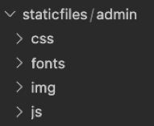
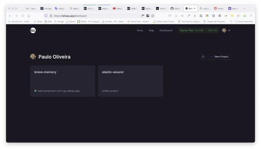

# Tutorial Django REST 07 – Efetuando o “deployment” de uma API usando o aplicativo `Railway` 

A etapa final para qualquer projeto de uma Web API é a implantação (i.e. *deployment*). No final deste tutorial espero que você consiga implementar seu primeiro projeto Django usando o aplicativo **Railway**.

**Railway** é uma plataforma em nuvem que efetua _deployments_ gratuitos configurados de uma forma simples, a qual remove obstáculos comuns ao desenvolvedor e sem precisar de uma “**Command Line Interface**” (**CLI**) – **Interface de Linha de Comando**. 


Para isto, siga atentamente os passos abaixo.


**Observação Importante: somente o faça depois de fazer o Tutorial Django REST 05**


## **Passo 1: Configure seu ambiente de desenvolvimento**

Sempre que você estiver iniciando um projeto de desenvolvimento web, é uma boa ideia configurá-lo primeiro.

1.1) Abra o Terminal no VS Code. Primeiro digite (CTRL+Shift+P) e use a opção “**View: Toggle Terminal**” ou “**Ver: Alternar Terminal**”.

1.2) Digite na linha de comando do Terminal:

```
cd Django_Tutoriais
mkdir Tutorial_REST_07
cd Tutorial_REST_07
```

1.3) Uma vez dentro do diretório (`Tutorial_REST_07`), crie um ambiente virtual. Para isto, digite o comando a seguir:

```
python3 -m venv deployenv
```


1.4) Agora você precisa ativar o ambiente virtual criado no Tutorial anterior, executando o comando abaixo:

**Linux/Mac**

```
source deployenv/bin/activate
```

**Windows**

```
.\deployenv\Scripts\activate.bat
```

Ou

```
.\deployenv\Scripts\Activate.ps1
```

Você saberá que seu ambiente virtual foi ativado, porque o _prompt_ do console no Terminal mudará. Deve ser assim:

```
(deployenv) $
```

1.5) Agora que você criou um ambiente virtual, é hora de instalar o Django. Digite na linha de comando:

```
(deployenv) $ pip install django
```


## **Passo 2: Criando seu projeto em Django**

2.1) Certifique-se de que você está dentro do diretório `Tutorial_REST_07` e o ambiente virtual ativado. Agora, para criar um projeto, digite o comando abaixo.

```
(clienv) $ django-admin startproject django_project .
```

> Observação: ao criar um novo projeto Django chamado “**django_project**” certifique-se de incluir o ponto (.) no final do comando para que ele seja instalado no diretório atual.
> 
> O comando acima irá criar uma pasta chamada “**django_project**” contendo alguns arquivos. No painel esquerdo do VS Code, você verá uma estrutura de diretório que se parece com a figura abaixo. 


## **Passo 3: Testando seu servidor Django**


3.1) Apenas para fins de teste, você pode iniciar o servidor de desenvolvimento que já vem embutido no Django. Para verificar se a configuração foi bem-sucedida, execute o seguinte comando no console do Terminal:

```
python manage.py runserver
```

Ao posicionar o mouse no link "http://127.0.0.1:8000/" você verá a seguinte mensagem:


No Windows irá aparecer “**Seguir o link (ctrl + click)**”. Ao efetuar esta operação, você será direcionado para uma aba do seu browser, e, se tudo estiver correto, você verá uma página da web como a da figura abaixo.


3.3) Parabéns, você acabou de criar um projeto, nossa configuração está correta e você o testou no servidor de desenvolvimento. Agora o Django está pronto para começarmos a desenvolver.


## **Passo 4: Criando uma aplicação em Django**

Para esta parte do tutorial, criaremos uma “**app**” chamada “**pages**”.

4.1) Para criá-la, execute o seguinte comando:

```
python manage.py startapp pages
```

Este comando irá criar um diretório chamado “**pages**” com vários arquivos. Veja a estrutura na figura abaixo.


4.2) Agora que você criou a “**app**”, temos que “instalá-la” no seu projeto. Abra o arquivo (“**django_project/settings.py**”) e adicione a seguinte linha de código em `INSTALLED_APPS`: (Não se esqueça de colocar a vírgula após a string).

```python
# config/settings.py
INSTALLED_APPS = [
    'django.contrib.admin',
    'django.contrib.auth',
    'django.contrib.contenttypes',
    'django.contrib.sessions',
    'django.contrib.messages',
    'django.contrib.staticfiles',
    'pages',
]
```

> Essa linha de código indica que seu projeto agora sabe que o aplicativo que você acabou de criar existe. 

4.3) Neste mesmo arquivo (“**config/settings.py**”) procure pelo comentário “**# Internationalization**” e altere as configurações para `LANGUAGE_CODE` e `TIME_ZONE`. Veja a figura abaixo. 


## **Passo 5: Criando um Banco de Dados**

5.1) Na linha de comando digite o comando abaixo:

```
python manage.py migrate
```


5.2) Agora, para confirmar se tudo está funcionando corretamente, reinicie nosso servidor no Terminal (**python manage.py runserver**), e visite "http://127.0.0.1:8000". Você deverá a seguinte página da web:


## **Passo 6: Criando nossas Views/URLs**

Agora vamos configurar uma “**view**” básica que retorne o texto "**Hello, World!**".

6.1) Abra o arquivo “**views.py**” no diretório (“**pages/views.py**”). Adicione o código abaixo nele (em destaque). 

```python
# pages/views.py
from django.http import HttpResponse

def homePageView(request):
    return HttpResponse("Hello, World!")
```


6.2) O último passo é configurar nosso URLConfs. Para isto, abra o arquivo “**django_project/urls.py**”. Atualize seu conteúdo de acordo com o código abaixo.

```
# django_project/urls.py
from django.contrib import admin
from django.urls import path, include  # new

urlpatterns = [
    path("admin/", admin.site.urls),
    path("", include("pages.urls")),  # new
]
```

6.3) Crie um arquivo na pasta “**pages**” chamado **“pages/urls.py**”. Adicione o código abaixo.

```python
# pages/urls.py
from django.urls import path
from .views import homePageView

urlpatterns = [
    path("", homePageView, name="home"),
]
```

6.4) Agora, ao reiniciar o servidor no Terminal (`python manage.py runserver`), visite "http://127.0.0.1:8000". Você deverá a seguinte página da web:


Até aqui a parte básica e funcional do Django está completa. O próximo passo é fazer o _deploy_ do nosso projeto/aplicação em ambiente de produção. É o que faremos no próximo passo.


## **Passo 7: Fazendo o `deployment`**


7.1) Abra o arquivo (“**django_project/settings.py**”) e atualize a seguinte linha de código abaixo:

```python
ALLOWED_HOSTS = ['*'] 
```


7.2) Na linha de comando do VS Code, digite o seguinte comando:

```
pip install gunicorn
```


7.3) Na linha de comando do VS Code, digite o seguinte comando:

```
pip freeze > requirements.txt
```

> O comando acima cria um arquivo chamado “requirements.txt”, que contém os pacotes em nosso ambiente virtual Python.

Caso deseje olhar o conteúdo dele, este será:

```
asgiref==3.5.2
Django==4.1.2
gunicorn==20.1.0
sqlparse==0.4.3
```


7.4) Crie um arquivo na pasta `Tutorial_REST_07` chamado `Tutorial_REST_07/Procfile`. Observe que o nome dele não contém nenhuma extensão. Adicione o código abaixo.

```
web: gunicorn 'django_project.wsgi'
```

O Railway precisa saber a versão do Python que você usou para o seu projeto. 

Para saber qual a usada, digite `python --version` na linha de comando do terminal. Depois, copie, cole e salve a versão dentro do arquivo “**runtime.txt**”, que será feito no próximo passo.


7.5) Crie um arquivo na pasta `Tutorial_REST_07` chamado `Tutorial_REST_07/runtime.txt`. Adicione resultado do comando `python --version` que foi efetuado no **Passo 7.4**.

```
Python 3.10.5
```

7.6) Abra o arquivo (“**django_project/settings.py**”) e adicione o código abaixo após a linha `STATIC_URL = 'static/'`:

```python
import os
STATICFILES_DIRS = [os.path.join(BASE_DIR, 'static')]
STATIC_ROOT =os.path.join(BASE_DIR, 'staticfiles')
```

7.7) Por fim, coletamos nossos arquivos estáticos em uma pasta usando o seguinte comando no Terminal:

```
python manage.py collectstatic
```

> Observe no painel da esquerda do VS Code que foi criada uma pasta chamada: `staticfiles`. Veja o conteúdo dela na figura abaixo.



7.8) Agora envie o projeto para sua conta do GitHub, de onde faremos o “**deploy**” dele. Não esqueça de criar um repositório antes. Após, na linha de comando digite os comandos abaixo. Use a seguinte sintaxe do git para adicionar (“**add**”), confirmar (“**commit**”) e enviar (“**push**”) seu código na linha de comando:

```
git init
git status
git add .
git commit -m 'mensagem qualquer'
git remote add Tutorial_REST_07 https://github.com/csp1po/Tutorial_REST_07
git push --set-upstream Tutorial_REST_07 master
```

> Neste momento temos um projeto Django instalado e configurado no GitHub. Então, podemos criar também um projeto no **Railway** e buscá-lo no nosso repositório (i.e. GitHub).


7.9) Agora, vá para a sua conta do aplicativo **Railway** que foi criada. Você deve se logar no site: "https://railway.app/". Você verá seu “**dashboard**” (figura abaixo).



7.10) Clique no botão `New Project` que se encontra à direita da página. E agora clique na opção `Deploy from GitHub repo`. Ver figura abaixo.


7.11) Selecione o repositório do seu projeto (i.e. aquele que você efetuou o `push`, no **Passo 7.8**). Veja a figura abaixo.


7.12) Agora clique na opção `Deploy Now`. Ver figura abaixo.


7.13) O **Railway** ajuda você a construir e implantar automaticamente seu projeto usando um gerenciador de pacotes chamado `nixpacks`. À medida que sua aplicação é construída, você pode ver o status da compilação/montagem. Uma vez que isso tenha sido feito, você verá a figura abaixo.


7.13) Agora clique no seu projeto e vá para a aba de configurações (`Settings`). Você verá algo parecido com a figura abaixo.


7.14) Na opção `Domains`, clique no botão `Generate Domain`. Ver figura abaixo.

 


7.15) Caso não apareça a opção acima (**Passo 7.14**), o **Railway** já sugere um URL. Neste caso ele sugeriu `tutorialrest07-production.up.railway.app`. Veja a figura abaixo.


7.16) Ao lado do URL (`tutorialrest07-production.up.railway.app`), clique no botão `Enable`. Um link personalizado para seu aplicativo que foi “**deployed**” é criado. E você pode visitá-lo clicando nele. Veja a figura abaixo.


Parabéns. Seu aplicativo foi implantado (i.e. “**deployed**”). Você poderá vê-lo em seu browser.

