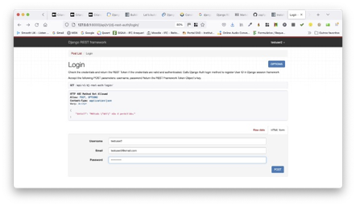

# Tutorial Django 04 - Como Aplicar A Autenticação do Usuário em Nossa Blog API

Neste Tutorial, implementaremos a **autenticação**, que é o processo pelo qual um usuário pode se registrar para uma nova conta (i.e. fazer o "**sign-up**"), fazer **login** com ela e sair (**logout**).

Dentro de um site Django tradicional e monolítico, a autenticação é mais simples e envolve um padrão de *cookie* baseado em sessão. Porém, com uma API as coisas são um pouco mais complicadas. Lembre-se de que o HTTP é um protocolo sem estado (“**stateless**”), portanto, não há uma maneira integrada de lembrar se um usuário está autenticado de uma requisição para outra. Cada vez que ele solicita um recurso restrito, ele deve verificar a si mesmo.

A solução é passar um identificador exclusivo com cada requisição HTTP. Confusamente, não há uma abordagem universalmente aceita para a forma desse identificador, e ele pode assumir várias dessas formas. O Django REST Framework (DRF) possui quatro opções de [autenticação](https://www.django-rest-framework.org/api-guide/authentication/#api-reference "tipos de autenticação no DRF") integradas diferentes: 

* básico
* sessão
* token  
* padrão

E há muitos outros pacotes de terceiros que oferecem recursos adicionais, como [**JSON Web Tokens** (**JWTs**)](https://jwt.io/ "JWT web site").

Faremos, primeiramente, uma explicação detalhada de como funciona a autenticação de uma API, depois indicaremos os prós e contras de cada abordagem e, em seguida, faremos uma escolha para nossa Blog API. Ao final do Tutorial, teremos criado **endpoints** para o registro (**sign-up**), o **login** e o **logout**. 

Vamos então descrever os quatro tipos de autenticação.

#### **Autenticação Básica**

A forma mais comum de autenticação HTTP é conhecida como autenticação “**básica**”. Quando um cliente faz uma requisição HTTP, ele é forçado a enviar uma credencial de autenticação aprovada antes que o acesso seja concedido. O fluxo completo de requisição/resposta é assim:

1.	O cliente faz uma requisição HTTP
2.	O servidor responde com uma resposta HTTP contendo um código de status 401 (**não autorizado**) e um Cabeçalho HTTP WWW-Authenticate com detalhes sobre como autorizar
3.	O cliente envia as credenciais de volta por meio do cabeçalho HTTP de autorização
4.	O servidor verifica as credenciais e responde com o código de status 200 (**OK**) ou 403 (**Proibido**)

Uma vez aprovado, o cliente envia todas as requisições futuras com as credenciais do cabeçalho HTTP de Autorização. Convém salientar que nesta opção de autenticação, as credenciais do usuário são transmitidas em texto puro e não criptografado pela Internet. Isso é incrivelmente inseguro. E, como se sabe, qualquer tráfego da Internet que não seja criptografado pode ser facilmente capturado e reutilizado. Assim, a autenticação básica só deve ser usada via [HTTPS](https://en.wikipedia.org/wiki/HTTPS "Protocolo HTTPS"), que é a versão segura do HTTP.


#### **Autenticação de Sessão**

Sites monolíticos, como o Django tradicional, há muito usam um esquema de autenticação alternativo, que é uma combinação de **sessões** e **cookies**. Em um nível alto, o cliente se autentica com suas credenciais (**nome de usuário/senha**) e, em seguida, recebe um **ID** de sessão do servidor que é armazenado como um **cookie**. Esse ID de sessão é então passado no cabeçalho de cada requisição HTTP futura.

Quando o ID de sessão é passado, o servidor o utiliza para pesquisar um objeto de sessão contendo todas as informações disponíveis para um determinado usuário, incluindo credenciais. Essa abordagem é **stateful** porque um registro deve ser guardado e mantido no servidor (o objeto de sessão) e no cliente (o ID da sessão).
A configuração padrão no DRF é na verdade uma combinação de **Autenticação Básica** e **Autenticação de Sessão**. O sistema tradicional de autenticação baseado em sessão do Django é usado e o ID da sessão é passado no cabeçalho HTTP em cada requisição via Autenticação Básica.

Existem várias desvantagens, no entanto. Primeiro, um ID de sessão só é válido no navegador em que o **login** foi realizado. Ou seja, ele não funcionará em vários domínios. Esse é um problema óbvio quando uma API precisa oferecer suporte a vários *front-ends*, como um site e um aplicativo móvel. Em segundo lugar, o objeto de sessão deve ser mantido atualizado, o que pode ser um desafio em sites grandes com vários servidores. Como você mantém a precisão de um objeto de sessão em cada servidor? E terceiro, o *cookie* é enviado para todas as requisições, mesmo aquelas que não exigem autenticação, o que é ineficiente.
Como resultado, geralmente não é aconselhável usar um esquema de autenticação baseado em sessão para qualquer API que tenha vários *front-ends*.


#### **Autenticação via Token**

O terceiro tipo é o que implementaremos em nosso Blog API. É uma abordagem mais popular nos últimos anos devido ao aumento de [aplicativos de página única](https://pt.wikipedia.org/wiki/Aplicativo_de_p%C3%A1gina_%C3%BAnica "Definição de APU"). Em inglês (*Single Page Application*).

A autenticação baseada em token é sem estado (“**stateless**”). Ou seja, assim que um cliente envia as credenciais iniciais do usuário para o servidor, um token exclusivo é gerado e armazenado pelo cliente como um cookie ou em [armazenamento local](https://developer.mozilla.org/pt-BR/docs/Web/API/Window/localStorage "Armazenamento Local"). Esse token é então passado no cabeçalho de cada requisição HTTP recebida e o servidor o utiliza para verificar se um usuário está autenticado. O próprio servidor não mantém um registro do usuário, apenas se um token é válido ou não.

Existem vários benefícios para esta abordagem. Como os tokens são armazenados no cliente, dimensionar os servidores para manter os objetos de sessão atualizados não é mais um problema. E os tokens podem ser compartilhados entre vários *front-ends*: o mesmo token pode representar um usuário no site e o mesmo usuário em um aplicativo móvel. O mesmo ID de sessão não pode ser compartilhado entre diferentes *front-ends*, uma grande limitação.

Uma desvantagem potencial é que os tokens podem crescer bastante. Um token contém todas as informações do usuário, não apenas um ID como com um ID de sessão/Objeto de sessão configurado. Como o token é enviado a cada requisição, gerenciar seu tamanho pode se tornar um problema de desempenho.

O `TokenAuthentication` integrado do Django REST Framework é deliberadamente muito básico. Como resultado, ele não oferece suporte à configuração de tokens para expirar, que é uma melhoria de segurança que pode ser adicionada. Ele também gera apenas um token por usuário, portanto, um usuário em um site e, posteriormente, um aplicativo móvel usará o mesmo token. Como as informações sobre o usuário são armazenadas localmente, isso pode causar problemas na manutenção e atualização de dois conjuntos de informações do cliente.


#### **Autenticação Padrão (Default)**

O primeiro passo é definir nossas novas configurações de autenticação. O DRF vem com várias [configurações](https://www.django-rest-framework.org/api-guide/settings/ "configurações DRF") que são definidas implicitamente. 

Por exemplo, `DEFAULT_PERMISSION_CLASSES` foi definido como `AllowAny` antes de ser atualizado para `IsAuthenticated` (veja o **Tutorial Django REST 02** e **Tutorial Django REST 03**).

O `DEFAULT_AUTHENTICATION_CLASSES` é definido por padrão. Então deve-se adicionar explicitamente `SessionAuthentication` e `BasicAuthentication` ao nosso arquivo “**config/settings.py**”. Veja abaixo.

```python
REST_FRAMEWORK = {
    'DEFAULT_PERMISSION_CLASSES': [
        'rest_framework.permissions.IsAuthenticated',
    ],
    'DEFAULT_AUTHENTICATION_CLASSES': [ 
        'rest_framework.authentication.SessionAuthentication',
        'rest_framework.authentication.BasicAuthentication'
    ], 
}
```

> Surge uma pergunta: por que usar os dois métodos? 
> 
> A resposta é que eles servem a propósitos diferentes. As sessões são usadas para alimentar a API navegável e a capacidade de fazer **login** e sair dela. 
> 
> E a básica é usada para passar o ID da sessão nos cabeçalhos HTTP para a própria API. Se você revisitar a API navegável em "http://127.0.0.1:8000/api/v1/", ela funcionará como antes. Tecnicamente, nada mudou, acabamos de tornar as configurações padrão explícitas.

Agora precisamos atualizar nosso sistema de autenticação para usar tokens.  Para isto, siga atentamente os passos abaixo.


**Observação Importante: somente o faça depois de fazer o Tutorial Django REST 02**


## **Passo 1: Configure seu ambiente de desenvolvimento**

Sempre que você estiver iniciando um projeto de desenvolvimento web, é uma boa ideia configurá-lo primeiro.

1.1) Abra o Terminal no VS Code. Primeiro digite (CTRL+Shift+P) e use a opção “**View: Toggle Terminal**” ou “**Ver: Alternar Terminal**”.

1.2) Digite na linha de comando do Terminal:

```
cd Django_Tutoriais
cd Tutorial_REST_02
```

1.3) Agora você precisa ativar o ambiente virtual criado no Tutorial anterior, executando o comando abaixo:

**Linux/Mac**

```
source blogenv/bin/activate
```

**Windows**

```
.\blogenv\Scripts\activate.bat
```

Ou

```
.\blogenv\Scripts\Activate.ps1
```

Você saberá que seu ambiente virtual foi ativado, porque o _prompt_ do console no Terminal mudará. Deve ser assim:

```
(blogenv) $
```


## **Passo 2: Logando-se como superusuário (`superuser`)**

2.1) Reinicie o servidor no Terminal (`python manage.py runserver`), e no seu browser vá para "http://127.0.0.1:8000/admin". Você deverá ver a tela de login do administrador (“**admin**”) que está na figura abaixo:


2.2) Faça o login inserindo o nome de usuário (`Username`) e a senha (`Password`) que você criou no **Passo 7.1** do Tutorial anterior. Você verá a página inicial do Django “**admin**” a seguir:


## **Passo 3: Atualizando o sistema de autenticação**


3.1) Abra o arquivo “**settings.py**” no diretório (“**config/settings.py**”). Substitua o código abaixo nele. 

```python
# config/settings.py
REST_FRAMEWORK = {
    'DEFAULT_PERMISSION_CLASSES': [
        'rest_framework.permissions.IsAuthenticated',
    ],
    'DEFAULT_AUTHENTICATION_CLASSES': [
        'rest_framework.authentication.SessionAuthentication',
        'rest_framework.authentication.TokenAuthentication',
    ], 
}
```

> Vamos manter `SessionAuthentication`, pois ainda precisamos dela para nossa API navegável, mas agora usamos tokens para passar credenciais de autenticação em nossos cabeçalhos HTTP. 

3.2) Também precisamos adicionar o aplicativo `authtoken` que gera os tokens no servidor. Ele vem incluído no Django REST Framework, mas deve ser adicionado à nossa configuração. Para isto, abra o arquivo (“**config/settings.py**”) e adicione a seguinte linha de código que está destacada em `INSTALLED_APPS`: (Não se esqueça de colocar a vírgula após a string).

```python
# config/settings.py
INSTALLED_APPS = [
    'django.contrib.admin',
    'django.contrib.auth',
    'django.contrib.contenttypes',
    'django.contrib.sessions',
    'django.contrib.messages',
    'django.contrib.staticfiles',
    'posts',
    'rest_framework',
    'rest_framework.authtoken',
]
```

3.3) Como fizemos alterações em nosso `INSTALLED_APPS`, precisamos sincronizar nosso Banco de Dados. Pare o servidor com “Control+C”. Em seguida, execute o seguinte comando. 

```
python manage.py migrate 
```

As mensagens abaixo irão aparecer na linha de comando:

```
Operations to perform:
  Apply all migrations: admin, auth, authtoken, contenttypes, posts, sessions
Running migrations:
  Applying authtoken.0001_initial... OK
  Applying authtoken.0002_auto_20160226_1747... OK
  Applying authtoken.0003_tokenproxy... OK
```

3.4) Inicialize o servidor de desenvolvimento (`python manage.py runserver`). Agora vá para "http://127.0.0.1:8000/admin/". Você verá que agora há uma seção chamada “**Tokens**” na parte inferior da página. Certifique-se de estar logado com sua conta de superusuário para ter acesso. Ver figura abaixo.


Clique no link para **Tokens**. A tela da figura abaixo irá aparecer. Atualmente não há nenhum deles, o que pode ser surpreendente. 


> Porém, temos usuários existentes. No entanto, os tokens só são gerados depois que há uma chamada de API para um usuário fazer **login**. Ainda não fizemos isso, então não há tokens. Faremos em breve!


## **Passo 4: Criando os Endpoints**

Agora precisamos criar **endpoints** para que os usuários possam fazer **login** e **logout**. Poderíamos criar um aplicativo de usuários dedicado para essa finalidade e, em seguida, adicionar nossos próprios **URLs**, “**views**” e “**serializers**”. No entanto, a autenticação do usuário é uma área em que realmente não queremos cometer erros. E como quase todas as APIs exigem essa funcionalidade, faz sentido que existam vários pacotes de terceiros excelentes e testados que podemos usar.

Para este tutorial, usaremos [`dj-rest-auth`](https://github.com/iMerica/dj-rest-auth "autenticação para o DRF") em combinação com [`django-allauth`](https://github.com/pennersr/django-allauth "autenticação para o DRF") para simplificar as coisas. 

Não se sinta mal por usar pacotes de terceiros. Eles existem por uma razão e até mesmo os melhores profissionais de Django confiam neles o tempo todo. Não adianta reinventar a roda se você não precisa!

4.1) Primeiro, adicionaremos os **endpoints** da API para login, logout e redefinição de senha (“**password reset**”). Eles vêm prontos para uso com o popular pacote `dj-rest-auth`. Pare o servidor com “Control+C” e instale-o. Na linha de comando digite o comando abaixo:

```
pip install dj-rest-auth
```

4.2) Abra o arquivo “**config/settings.py**”, e adicione a seguinte linha de código que está destacada em `INSTALLED_APPS`: (Não se esqueça de colocar a vírgula após a string).

```python
# config/settings.py
INSTALLED_APPS = [
    'django.contrib.admin',
    'django.contrib.auth',
    'django.contrib.contenttypes',
    'django.contrib.sessions',
    'django.contrib.messages',
    'django.contrib.staticfiles',
    'posts',
    'rest_framework',
    'rest_framework.authtoken',
    'dj_rest_auth',
]
```

4.3) Agora atualize nosso arquivo “**config/urls.py**” com o pacote `dj_rest_auth`. Estamos definindo as rotas de URL para `api/v1/dj-rest-auth`. Certifique-se de observar que os URLs devem ter um traço “-“, e não um sublinhado “_”, o que é um erro fácil de cometer. Substitua o seu conteúdo pelo que está abaixo.

```python
# config/urls.py
from django.contrib import admin 
from django.urls import include, path

urlpatterns = [
    path('admin/', admin.site.urls),
    path('api/v1/', include('posts.urls')),
    path('api-auth/', include('rest_framework.urls')),
    path('api/v1/dj-rest-auth/', include('dj_rest_auth.urls')),
]
```

4.4) E terminamos! Se você já tentou implementar seus próprios **endpoints** de autenticação de usuário, é realmente incrível quanto tempo, e dor de cabeça, o pacote `dj-rest-auth` economiza para nós. Agora podemos ativar o servidor (`python manage.py runserver`) para ver o que ele (pacote) nos forneceu. Vá para o endereço "http://127.0.0.1:8000/api/v1/dj-rest-auth/login/" e observe que temos um **endpoint** de login. Veja a figura abaixo.


4.5) Temos também um **endpoint** de logout em "http://127.0.0.1:8000/api/v1/dj-rest-auth/logout/". Ver figura abaixo.


4.6) Existe também um **endpoint** para redefinição de senha (“**password reset**”) em
"http://127.0.0.1:8000/api/v1/dj-rest-auth/password/reset". Ver figura abaixo.


4.7) Temos também um **endpoint** para redefinição de senha (“**password reset**”) confirmada:
"http://127.0.0.1:8000/api/v1/dj-rest-auth/password/reset/confirm". Ver figura abaixo.


## **Passo 5: Incluindo Registro de Usuário (Sign-up)**

O próximo passo é o **endpoint** do nosso registro do usuário. O Django tradicional não vem com “**views**” ou **URLs** embutidas para registro de usuário e nem o Django REST Framework. Isto significa que precisamos escrever nosso próprio código do zero, o que é uma abordagem um tanto arriscada, dada a seriedade, e as implicações de segurança, de errar.

Uma abordagem popular é usar o pacote de terceiros `django-allauth` o qual vem com o registro do usuário, bem como uma série de recursos adicionais ao sistema de autenticação do Django, como autenticação social via Facebook, Google, Twitter, etc. Se adicionarmos `dj_rest_auth.registration` do pacote `dj-rest-auth`, também teremos **endpoints** de registro do usuário! Por via das dúvidas, pare o servidor local com “Control+C” e instale `django-allauth`.


5.1) Na linha de comando digite o comando abaixo:

```
pip install django-allauth
```

5.2) Abra o arquivo “**config/settings.py**”, e substitua o conteúdo dele. (Não se esqueça de colocar a vírgula após a string).

```python
# config/settings.py
INSTALLED_APPS = [
    'django.contrib.admin',
    'django.contrib.auth',
    'django.contrib.contenttypes',
    'django.contrib.sessions',
    'django.contrib.messages',
    'django.contrib.staticfiles',
    'django.contrib.sites',
    'posts',
    'rest_framework',
    'rest_framework.authtoken',
    'allauth',
    'allauth.account',
    'allauth.socialaccount',
    'dj_rest_auth',   
    'dj_rest_auth.registration',
]
```

5.3) No mesmo arquivo “**config/settings.py**”, adicione o conteúdo abaixo no final dele.

```python
EMAIL_BACKEND = 'django.core.mail.backends.console.EmailBackend'
SITE_ID = 1 # new
```

> A configuração de e-mail (**backend**) acima é necessária, pois, por padrão, um e-mail será enviado quando um novo usuário for registrado, solicitando que ele confirme sua conta. Em vez de também configurar um servidor de e-mail, enviaremos os e-mails para o console com a configuração `console.EmailBackend`.
> 
> Já o `SITE_ID` faz parte da [estrutura interna de “sites” do Django](https://docs.djangoproject.com/pt-br/5.0/ref/contrib/sites/ "the sites framework"), que é uma maneira de hospedar vários sites do mesmo projeto Django. Obviamente, temos apenas um site em que estamos trabalhando aqui, mas o `django-allauth` usa a estrutura de sites, e, portanto, devemos especificar uma configuração padrão.

5.4) No mesmo arquivo “**config/settings.py**”, procure pela lista "**MIDDLEWARE**", e substitua o seu conteúdo pelo que está abaixo.

```python
MIDDLEWARE = [
'django.middleware.security.SecurityMiddleware',
'django.contrib.sessions.middleware.SessionMiddleware',
'django.middleware.common.CommonMiddleware',
'django.middleware.csrf.CsrfViewMiddleware',
'django.contrib.auth.middleware.AuthenticationMiddleware',
'django.contrib.messages.middleware.MessageMiddleware',
'django.middleware.clickjacking.XFrameOptionsMiddleware',
'allauth.account.middleware.AccountMiddleware',
]
```


5.5) Bem, como adicionamos novos aplicativos, então é hora de atualizar o Banco de Dados. Na linha de comando digite:

```
python manage.py migrate
```

As mensagens abaixo irão aparecer.

```
Operations to perform:
  Apply all migrations: account, admin, auth, authtoken, contenttypes, posts, sessions, sites, socialaccount
Running migrations:
  Applying account.0001_initial... OK
  Applying account.0002_email_max_length... OK
  Applying sites.0001_initial... OK
  Applying sites.0002_alter_domain_unique... OK
  Applying socialaccount.0001_initial... OK
  Applying socialaccount.0002_token_max_lengths... OK
  Applying socialaccount.0003_extra_data_default_dict... OK
```

5.6) Agora atualize nosso arquivo "**config/urls.py**" para adicionar a nova rota de URL para o registro.

```python
# config/urls.py
from django.contrib import admin 
from django.urls import include, path
urlpatterns = [
    path('admin/', admin.site.urls),
    path('api/v1/', include('posts.urls')),
    path('api-auth/', include('rest_framework.urls')),
    path('api/v1/dj-rest-auth/', include('dj_rest_auth.urls')),
    path('api/v1/dj-rest-auth/registration/', include('dj_rest_auth.registration.urls')),
]
```

5.7) E terminamos! Agora podemos ativar o servidor (`python manage.py runserver`). Vá para o endereço 
"http://127.0.0.1:8000/api/v1/dj-rest-auth/registration/" e observe a figura abaixo.


## **Passo 6: Trabalhando com os Tokens**

6.1) Para garantir que tudo funcione, crie uma terceira conta de usuário por meio do **endpoint** da API navegável. Vá para o endereço do **Passo 5.6**, que é:
"http://127.0.0.1:8000/api/v1/dj-rest-auth/registration/". Eu chamei meu usuário de `testuser2`. Em seguida, clique no botão `POST`. Veja a figura abaixo.


6.2) A próxima tela mostra a resposta HTTP do servidor. Nosso POST de registro de usuário foi bem-sucedido, daí o código de status **HTTP 201** criado na parte superior. A chave de valor de retorno é o token de autenticação para esse novo usuário. Veja a figura abaixo.


> Se você olhar para o console da linha de comando, um e-mail foi gerado automaticamente pelo “django-allauth”. Este texto padrão pode ser atualizado e um servidor SMTP de e-mail também pode ser adicionado com configuração adicional. As mensagens estão abaixo.


```
Content-Type: text/plain; charset="utf-8"
MIME-Version: 1.0
Content-Transfer-Encoding: 7bit
Subject: [example.com] Please Confirm Your E-mail Address
From: webmaster@localhost
To: testuser2@email.com
Date: Mon, 12 Sep 2022 20:09:11 -0000
Message-ID: 
 <166301335101.66974.10935650630831977185@MacBook-Air-de-Paulo.local>

Hello from example.com!

You're receiving this e-mail because user testuser2 has given your e-mail address to register an account on example.com.

To confirm this is correct, go to http://127.0.0.1:8000/api/v1/dj-rest-auth/registration/account-confirm-email/MQ:1oXpjy:W95J0JKppey-mSHl85zcngFFvDdkBKzHQFIjSGfGVEg/

Thank you for using example.com!
example.com
```

6.3) Mude o seu navegador para o módulo “**admin**” do Django em "http://127.0.0.1:8000/admin/". Você precisará usar sua conta de superusuário (`superuser`) para isso, ou seja, você deve se logar novamente. Em seguida, clique no link para “**Tokens**” na parte inferior da página. Você será redirecionado para a página de **Tokens**. Veja figura abaixo.


> Um único token foi gerado pelo Django REST Framework para o usuário `testuser2`. 
> 
> À medida que usuários adicionais são criados por meio da API, seus tokens também aparecerão aqui. 
> 
> Uma pergunta lógica é: por que não há tokens para nossa conta de superusuário (`admin` no meu caso) ou `testuser`? A resposta é que criamos essas contas antes que a autenticação de token fosse adicionada. Mas não se preocupe, assim que fizermos login com qualquer uma das contas por meio da API, um **token** será adicionado e disponibilizado automaticamente. 

6.4) Seguindo em frente, vamos fazer **login** com nossa nova conta `testuser2`. No navegador da Web, navegue até 
"http://127.0.0.1:8000/api/v1/dj-rest-auth/login/". Insira as informações para nossa conta e clique no botão `POST`. Ver figura abaixo.



> Duas coisas aconteceram. No canto superior direito, sua conta de usuário `testuser2` está visível, confirmando que agora estamos logados nela. Além disso, o servidor enviou uma resposta HTTP com o token. Veja a figura abaixo.


> Em nosso framework de front-end, precisaríamos capturar e armazenar esse token. Tradicionalmente isso acontece no cliente, seja em [`localStorage`](https://developer.mozilla.org/pt-BR/docs/Web/API/Window/localStorage) ou como um **cookie**, e então todas as requisições futuras incluem o token no cabeçalho como forma de autenticar o usuário. Observe que há preocupações de segurança adicionais neste tópico, portanto, você deve tomar cuidado para implementar as práticas recomendadas de seu framework de front-end de escolha.
> 
> A autenticação do usuário é uma das áreas mais difíceis de entender ao trabalhar pela primeira vez com APIs para web. Sem o benefício de uma estrutura monolítica, nós, como desenvolvedores, precisamos entender profundamente e configurar adequadamente nossos ciclos de requisição/resposta HTTP.
>
> O Django REST Framework vem com muito suporte embutido para este processo, incluindo `TokenAuthentication`. No entanto, os desenvolvedores devem configurar áreas adicionais, como registro de usuário e URLS/views dedicadas. Como resultado, uma abordagem popular, poderosa e segura é confiar nos pacotes de terceiros `dj-rest-auth` e `django-allauth` para minimizar a quantidade de código que temos que escrever do zero.
